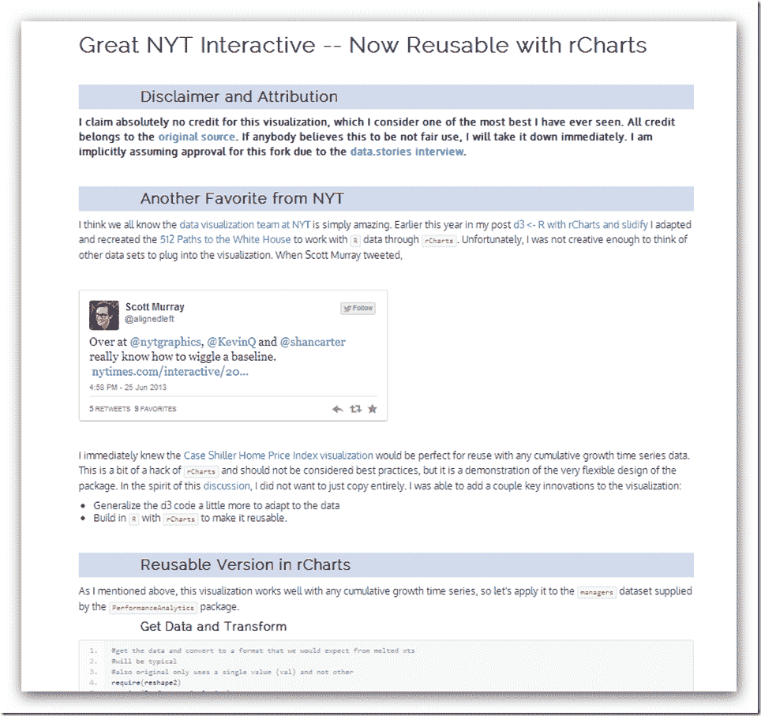

<!--yml
category: 未分类
date: 2024-05-18 14:59:27
-->

# Timely Portfolio: rCharts Remake of NYT

> 来源：[http://timelyportfolio.blogspot.com/2013/06/rcharts-remake-of-nyt.html#0001-01-01](http://timelyportfolio.blogspot.com/2013/06/rcharts-remake-of-nyt.html#0001-01-01)

For those wondering if I have forsaken finance, the answer is no.  I just don’t think there is much to do in here besides watch and wait.  So more d3 and R as I try to distract myself from doing something dumb in the markets.

This time I used [rCharts](http://rcharts.io/site) and [slidify](http://slidify.org) to  recreate another [NYT visualization](http://www.nytimes.com/interactive/2011/05/31/business/economy/case-shiller-index.html) similar to what I did in [512 Paths to the White House](http://www.nytimes.com/interactive/2012/11/02/us/politics/paths-to-the-white-house.html).  Now with any cumulative growth time series that we build in R we can apply the template and create this amazing visualization.  Below is a screenshot.  Click [here to see the live version](http://timelyportfolio.github.io/rCharts_nyt_home_price/).

I’ll be living the good life over the next week, so no posts until after the 4th of July.