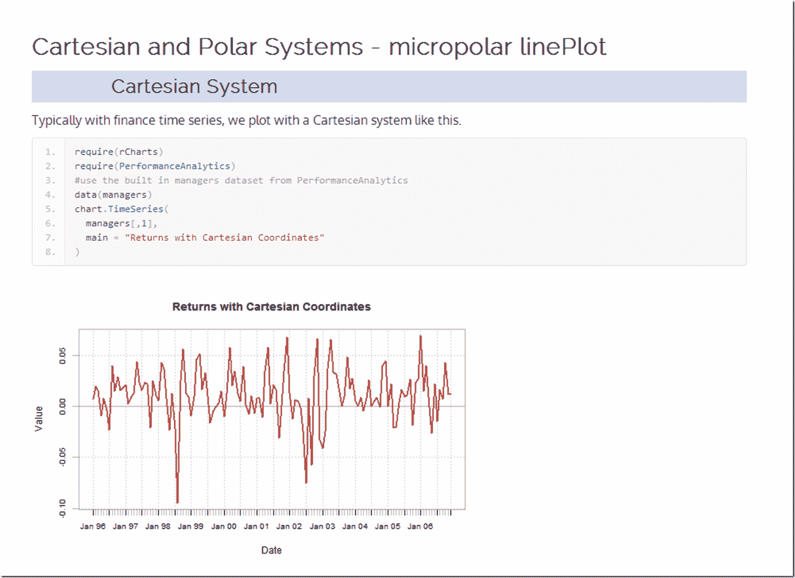

<!--yml
category: 未分类
date: 2024-05-18 14:57:10
-->

# Timely Portfolio: rCharts goes Polar

> 来源：[http://timelyportfolio.blogspot.com/2013/10/rcharts-goes-polar.html#0001-01-01](http://timelyportfolio.blogspot.com/2013/10/rcharts-goes-polar.html#0001-01-01)

The new [micropolar](http://micropolar.org) library from Chris Viau, author of

  gives us reusable charts with polar coordinates for [d3.js](http://d3js.org).  In testament to [rCharts](http://rcharts.io/howitworks) design, Ramnath Vaidyanathan integrated micropolar with rCharts in less than 30 minutes.  I don’t use polar coordinates much, so I wrote this [quick little comparison of Cartesian and Polar systems](http://timelyportfolio.github.io/rCharts_micropolar/coord_polar) using simulated money manager returns to get me up to speed.

