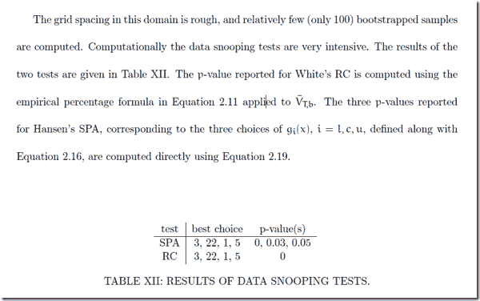

<!--yml
category: 未分类
date: 2024-05-18 15:11:39
-->

# Timely Portfolio: ttrTests This is a Test Test 3:Data Snoopy

> 来源：[http://timelyportfolio.blogspot.com/2011/09/ttrtests-this-is-test-test-3data-snoopy.html#0001-01-01](http://timelyportfolio.blogspot.com/2011/09/ttrtests-this-is-test-test-3data-snoopy.html#0001-01-01)

THIS IS NOT INVESTMENT ADVICE.  IT IS JUST AN EXAMPLE AND WILL LIKELY LOSE LOTS OF MONEY IF YOU PURSUE WHAT IS DISCUSSED.  READER IS RESPONSIBLE FOR THEIR OWN GAINS OR LOSSES.  IF YOU ARE AN UNLIKELY WINNER, I WOULD LOVE TO HEAR YOUR STORY.

When we are deciding on a quantitative system to guide our investments, we have multiple choices all fraught with potential luck:  investment choice, system type, system, timeframe, system parameter or parameters, and money management.  To really gain some confidence in the persistence of your choices, I believe each choice should be as rigorously tested as possible.  [http://math.uic.edu/~dstjohn/thesis.pdf](http://math.uic.edu/~dstjohn/thesis.pdf), [http://ageconsearch.umn.edu/bitstream/19039/1/cp05pa01.pdf](http://ageconsearch.umn.edu/bitstream/19039/1/cp05pa01.pdf "http://ageconsearch.umn.edu/bitstream/19039/1/cp05pa01.pdf"), and [http://www.ssc.wisc.edu/~bhansen/718/White2000.pdf](http://www.ssc.wisc.edu/~bhansen/718/White2000.pdf "http://www.ssc.wisc.edu/~bhansen/718/White2000.pdf") all offer very good discussion of some of the tests.  My posts [ttrTests This is a Test--Test 1 and Test 2](http://timelyportfolio.blogspot.com/2011/09/ttrtests-this-is-test-test-1-and-test-2.html), [ttrTests: Its Great Thesis and Incredible Potential](http://timelyportfolio.blogspot.com/2011/09/ttrtests-its-great-thesis-and.html), and [ttrTests Experimentation](http://timelyportfolio.blogspot.com/2011/08/ttrtests-experimentation.html) offer a simple application of the much-less-than-simple statistical tests.

I will apply the dataSnoop test with Hansen’s test for Superior Predictive Ability (SPA) to check for luck in the parameter choice of my simple CUD indicator.

I hate to do this, but I cannot think of an easy way to describe the output of the dataSnoop test, so I hope you will read [http://math.uic.edu/~dstjohn/thesis.pdf](http://math.uic.edu/~dstjohn/thesis.pdf) pages 51-57.  Here is the paper’s description of the tests when applied to a MACD system.  [](http://math.uic.edu/~dstjohn/thesis.pdf)

[http://math.uic.edu/~dstjohn/thesis.pdf](http://math.uic.edu/~dstjohn/thesis.pdf) page 55

p-values for my CUD indicator are not so good.

> CUD: Observed P-values for Means 'l', 'c', and 'u' respectively: 0.4 0.4 0.97

The observed values from the test are plotted below.

[R code (click to download from Google Docs):](https://docs.google.com/leaf?id=0B2qp2r96khJPMzFlZTMyNTUtNjhhZS00NmMyLWI0MGMtOTc5NDEwNjQ4YWQx&hl=en_US)

```
#let's define our silly countupdown function
#as a sample of a custom ttr rule
CUD <- function(x,params=50,...) {
	#CUD takes the n-period sum of 1 (up days) and -1 (down days)
	temp <- ifelse(runSum(ifelse(ROC(x,1,type="discrete") > 0,1,-1),params)>=0,1,0)
	#replace NA with 0 at beginning of period
	temp[is.na(temp)] <- 0
	temp
}   require(ttrTests)
require(quantmod)
require(lattice)
require(reshape2)
require(PerformanceAnalytics)   #defaults functions is overridden by ggplot2 and plyr if loaded
#and will cause problems if you want to use ttrTests concurrently   tckrs <- c("GSPC","RUT","N225","GDAXI","DJUBS")   #use 1 or GSPC but adjust however you would like
i=1
getSymbols(paste("^",tckrs[i],sep=""),from="1896-01-01",to=Sys.Date())
test_price <- as.vector(get(tckrs[i])[,4])   #run dataSnoop to test for luck
#by checking all parameters across multiple bootstrap samples
#this takes a long time, so for experimenting change bSamples to
#something smaller than 100
#if you are planning to use this for commercial purposes
#make sure you see the warning in the documentation
#on Dr. Halbert White's patent and his paper
#http://www.ssc.wisc.edu/~bhansen/718/White2000.pdf   #don't get me started on patents of this sort   #crit can be "sharpe", "return", or "adjust"
#will choose "sharpe" but feel free to try them all
snoop <- dataSnoop(x=test_price, ttr = CUD, start = 20, nSteps = 30, stepSize = 10,
	bSamples=100, crit="sharpe",
	restrict = FALSE, burn = 0, short = FALSE, condition = NULL,
	silent = TRUE, TC = 0.001, loud = TRUE, alpha = 0.025,
	begin = 1, percent = 1, file = "", benchmark = "hold")   #make output slightly more usable with some naming
#believe I got this right
names(snoop) <- c("details","V1","V2",
	"V3","p1.for.l","p2.for.c","p3.for.u")   #jpeg(filename="dataSnoop values.jpg",
	quality=100,width=6.25, height = 6.25,  units="in",res=96)
plot(snoop$V3,
	type="l", col=2,
	main="ttrTests dataSnoop V1,V2,and V3 on CUD",
	xlab="Bootstrap Sample", ylab="Values")
points(snoop$V2, type="l", col=3)
points(snoop$V1, col=4)
legend("topright",legend=c("V1","V2","V3"),col=c(4,3,2),pch=19,lty=1)
#dev.off()
```

[Created by Pretty R at inside-R.org](http://www.inside-r.org/pretty-r "Created by Pretty R at inside-R.org")