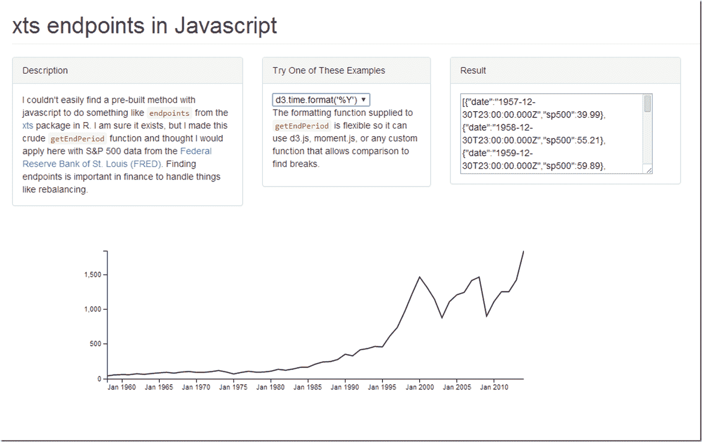

<!--yml
category: 未分类
date: 2024-05-18 14:54:36
-->

# Timely Portfolio: xts like endpoints in Javascript

> 来源：[http://timelyportfolio.blogspot.com/2014/04/xts-like-endpoints-in-javascript.html#0001-01-01](http://timelyportfolio.blogspot.com/2014/04/xts-like-endpoints-in-javascript.html#0001-01-01)

I decided to promote this from a Twitter comment to a blog post.  I had hoped to do a prototype javascript interactive rebalancing visualization of [Unsolved Mysteries of Rebalancing](http://timelyportfolio.blogspot.com/2014/02/unsolved-mysteries-of-rebalancing.html) integrating this, but I have not had the time, so  I’ll release it into the wild in its current state.  I hope someone can use it.

