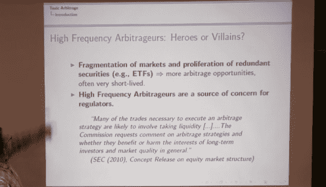

<!--yml
category: 未分类
date: 2024-05-18 14:25:35
-->

# Toxic latency arbitrage #nbbo – Sniper In Mahwah & friends

> 来源：[https://sniperinmahwah.wordpress.com/2013/09/05/toxic-latency-arbitrage-nbbo/#0001-01-01](https://sniperinmahwah.wordpress.com/2013/09/05/toxic-latency-arbitrage-nbbo/#0001-01-01)

With the SIP/NBBO/Nasdaq outage two weeks ago, latency arbitrage between ECNS (first experimented by Tradebot through Island as I wrote [here](https://sniperinmahwah.wordpress.com/2013/08/26/nasdark-2-de-lespace-et-du-temps/)) is a very discussed issue these days. Arbitrage is one of  the main components of markets (we can find “spatial” arbitrage back to the Roman Empire), but it seems that hft arbitrage could be, let’s say… “toxic”.

Here is a talk by [Thierry Foucault](https://studies2.hec.fr/jahia/Jahia/foucault), given yesterday at the Banff International Research Station for Mathematical Innovation and Discovery [event](http://www.birs.ca/events/2013/5-day-workshops/13w5008) about high frequency trading, on the different kind of arbitrages and the problems with hft arbs.

