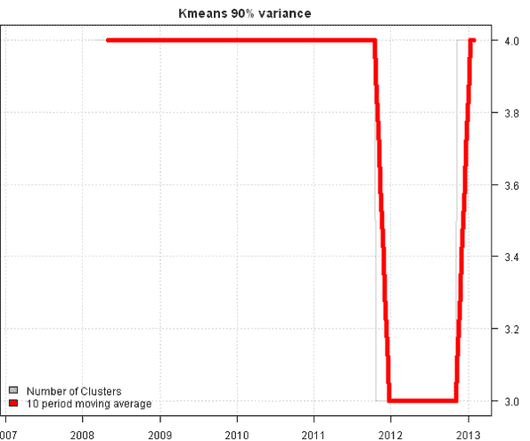
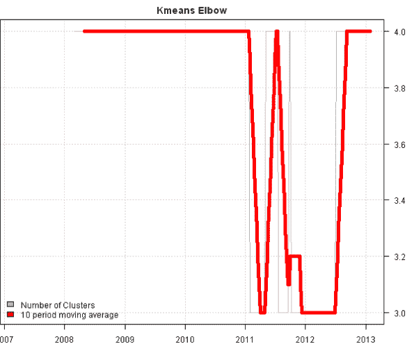
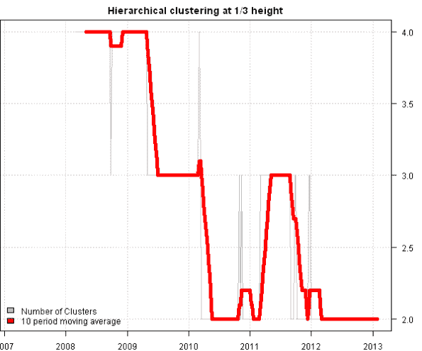

<!--yml
category: 未分类
date: 2024-05-18 14:34:25
-->

# Tracking Number of Historical Clusters | Systematic Investor

> 来源：[https://systematicinvestor.wordpress.com/2013/01/27/tracking-number-of-historical-clusters/#0001-01-01](https://systematicinvestor.wordpress.com/2013/01/27/tracking-number-of-historical-clusters/#0001-01-01)

In the prior post, [Optimal number of clusters](https://systematicinvestor.wordpress.com/2013/01/17/optimal-number-of-clusters/), we looked at methods of selecting number of clusters. Today, I want to continue with clustering theme and show historical Number of Clusters time series using these methods.

In particular, I will look at the following methods of selecting optimal number of clusters:

*   Minimum number of clusters that explain at least 90% of variance
*   Elbow method
*   Hierarchical clustering tree cut at 1/3 height

Let’s first load historical prices for the 10 major asset classes

```

###############################################################################
# Load Systematic Investor Toolbox (SIT)
# https://systematicinvestor.wordpress.com/systematic-investor-toolbox/
###############################################################################
setInternet2(TRUE)
con = gzcon(url('http://www.systematicportfolio.com/sit.gz', 'rb'))
    source(con)
close(con)

	#*****************************************************************
	# Load historical data for ETFs
	#****************************************************************** 
	load.packages('quantmod')

	tickers = spl('GLD,UUP,SPY,QQQ,IWM,EEM,EFA,IYR,USO,TLT')

	data <- new.env()
	getSymbols(tickers, src = 'yahoo', from = '1900-01-01', env = data, auto.assign = T)
		for(i in ls(data)) data[[i]] = adjustOHLC(data[[i]], use.Adjusted=T)

	bt.prep(data, align='remove.na')

```

Next, I created 3 helper functions to automate cluster selection. In particular, I used following methods of selecting optimal number of clusters:

*   Minimum number of clusters that explain at least 90% of variance – cluster.group.kmeans.90 function
*   Elbow method – cluster.group.kmeans.elbow function
*   Hierarchical clustering tree cut at 1/3 height – cluster.group.hclust function

To view the complete source code for these functions please have a look at the [startegy.r at github](https://github.com/systematicinvestor/SIT/blob/master/R/strategy.r).

Let’s use these functions on our data set every week with 250 days look-back to compute correlations.

```

	#*****************************************************************
	# Use following 3 methods to determine number of clusters
	# * Minimum number of clusters that explain at least 90% of variance
	#   cluster.group.kmeans.90
	# * Elbow method
	#   cluster.group.kmeans.elbow
	# * Hierarchical clustering tree cut at 1/3 height
	#   cluster.group.hclust
	#****************************************************************** 

	# helper function to compute portfolio allocation additional stats
	portfolio.allocation.custom.stats.clusters <- function(x,ia) {
		return(list(
			ncluster.90 = max(cluster.group.kmeans.90(ia)),
			ncluster.elbow = max(cluster.group.kmeans.elbow(ia)),
			ncluster.hclust = max(cluster.group.hclust(ia))
		))
	}

	#*****************************************************************
	# Compute # Clusters
	#****************************************************************** 		
	periodicity = 'weeks'
	lookback.len = 250

	obj = portfolio.allocation.helper(data$prices, 
		periodicity = periodicity, lookback.len = lookback.len,
		min.risk.fns = list(EW=equal.weight.portfolio),
		custom.stats.fn = portfolio.allocation.custom.stats.clusters
	) 

```

Finally, the historical number of cluster time series plots for each method:

```

	#*****************************************************************
	# Create Reports
	#****************************************************************** 		
	temp = list(ncluster.90 = 'Kmeans 90% variance',
		 ncluster.elbow = 'Kmeans Elbow',
		 ncluster.hclust = 'Hierarchical clustering at 1/3 height')	

	for(i in 1:len(temp)) {
		hist.cluster = obj[[ names(temp)[i] ]]
		title = temp[[ i ]]

		plota(hist.cluster, type='l', col='gray', main=title)
			plota.lines(SMA(hist.cluster,10), type='l', col='red',lwd=5)
		plota.legend('Number of Clusters,10 period moving average', 'gray,red', x = 'bottomleft')			
	}

```

[](https://systematicinvestor.wordpress.com/wp-content/uploads/2013/01/plot1-small1.png)

[](https://systematicinvestor.wordpress.com/wp-content/uploads/2013/01/plot2-small.png)

[](https://systematicinvestor.wordpress.com/wp-content/uploads/2013/01/plot3-small.png)

All methods selected clusters a little bit differently, as expected. The “Minimum number of clusters that explain at least 90% of variance” method seems to produce the most stable results. I would suggest looking at the larger universe (for example DOW30) and longer period of time (for example 1995-present) to evaluate these methods.

Takeaways: As I mentioned in the [Optimal number of clusters](https://systematicinvestor.wordpress.com/2013/01/17/optimal-number-of-clusters/) post, there are many different methods to create clusters, and I have barely scratched the surface. There is also another dimension that I have not explored yet, the distance matrix. Currently, I’m using a correlation matrix as a distance measure to create clusters. I was pointed out by Matt Considine that there is an R interface to the [Maximal Information-based Nonparametric Exploration (MINE)](http://www.exploredata.net/) metric that can be used as a better measure of correlation.

To view the complete source code for this example, please have a look at the [bt.cluster.optimal.number.historical.test() function in bt.test.r at github](https://github.com/systematicinvestor/SIT/blob/master/R/bt.test.r).