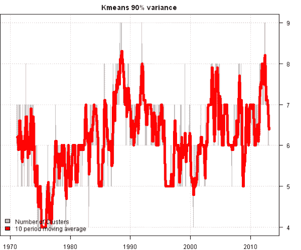
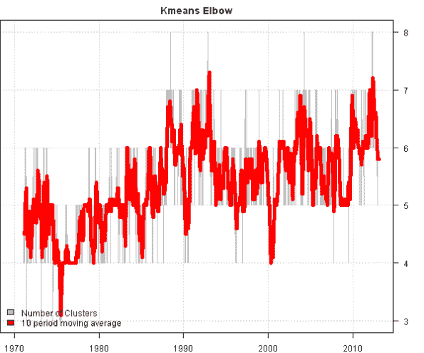
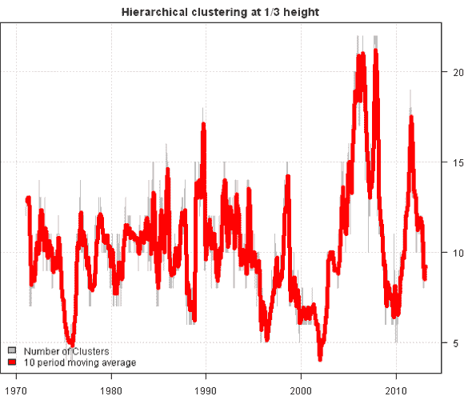
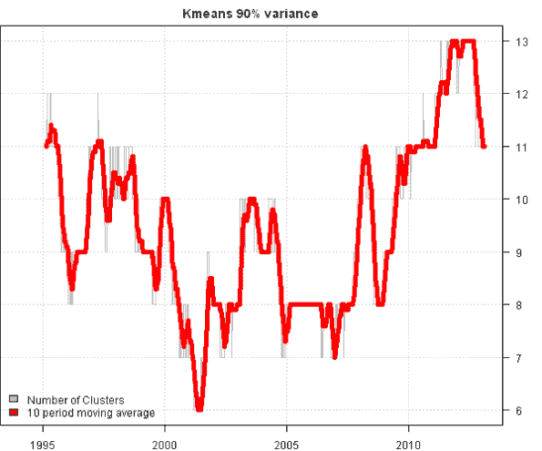
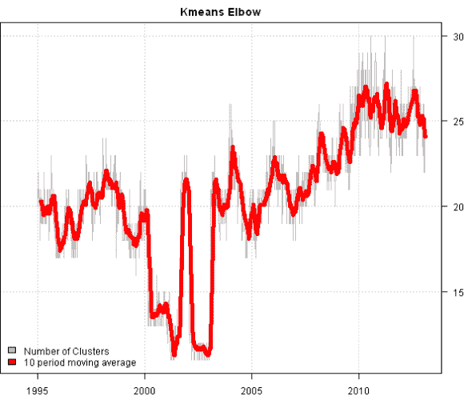
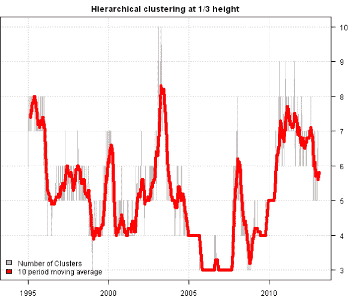

<!--yml
category: 未分类
date: 2024-05-18 14:34:09
-->

# Tracking Number of Historical Clusters in DOW 30 and S&P 500 | Systematic Investor

> 来源：[https://systematicinvestor.wordpress.com/2013/02/05/tracking-number-of-historical-clusters-in-dow-30-and-sp-500/#0001-01-01](https://systematicinvestor.wordpress.com/2013/02/05/tracking-number-of-historical-clusters-in-dow-30-and-sp-500/#0001-01-01)

[Home](https://systematicinvestor.wordpress.com/ "Go to homepage")

>

[Cluster](https://systematicinvestor.wordpress.com/category/cluster/)

,

[R](https://systematicinvestor.wordpress.com/category/r/)

> Tracking Number of Historical Clusters in DOW 30 and S&P 500

## Tracking Number of Historical Clusters in DOW 30 and S&P 500

In the [Tracking Number of Historical Clusters](https://systematicinvestor.wordpress.com/2013/01/27/tracking-number-of-historical-clusters/) post, I looked at how 3 different methods were able to identify clusters across the 10 major asset universe. Today, I want to share the impact of clustering on the larger universe. Below I examined the historical time series of number of clusters in the DOW 30 and S&P 500 indices.

I went back to the 1970 for the companies in DOW 30 index.

I went back to the 1994 for the companies in S&P 500 index.

Takeaways: The markets are changing, and correspondingly the diversification (i.e. number of clusters) goes thought cycles as can be seen in the charts. The results will vary across different methods and must be validated by the user. For example, some readers will consider an average of 10 clusters for S&P 500 as too small, while others might think that 10 clusters as sufficient.