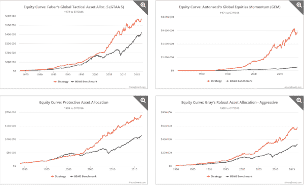

<!--yml
category: 未分类
date: 2024-05-12 17:45:07
-->

# Tracking the Performance of Tactical Strategies | CSSA

> 来源：[https://cssanalytics.wordpress.com/2016/09/08/tracking-the-performance-of-tactical-strategies/#0001-01-01](https://cssanalytics.wordpress.com/2016/09/08/tracking-the-performance-of-tactical-strategies/#0001-01-01)

There is a [cool new website](https://allocatesmartly.com/) that tracks the performance of well-known tactical strategies. [AllocateSmartly](https://allocatesmartly.com/)  has collected an extensive list of strategies from well-known hedge fund managers like Ray Dalio along with several other portfolio managers and financial bloggers. The backtests for these strategies use a very detailed and comprehensive method that is both conservative and realistic. Where possible, the author uses tradeable assets rather than indices and factors in transaction costs along with careful treatment of dividends. The current allocations and performance are tracked in real-time which allows investors to be able to realistically trade these portfolios. Curiously the best performing model tracked on the website this year is the [Minimum Correlation Algorithm](https://cssanalytics.wordpress.com/2012/09/12/minimum-correlation-algorithm-mca/) from CSSA which says a lot about the importance of diversification in 2016 versus momentum and managing risk via trend-following/time-series momentum. In fact, if you dig deeper you will notice that most of the best performers have a structural or dynamic diversification element. The worst performers have been the most concentrated and oriented toward identifying the best performers. As the website correctly points out- the diversification oriented strategies tend to do well during normal market conditions but ultimately the dynamic and more tactical strategies outperform during bear markets. Over longer backtest periods, the more truly tactical performers had better long-term performance. Different market regimes will reward different approaches depending on how predictable and interrelated the markets happen to be that year. An umbrella is great for a rain storm but less than ideal for a sunny day. That is why it is important to understand the strategies you are following and why you are investing in them rather than blindly chase performance. While many quant developers and investors chase the best looking equity curves it is important to consider two primary factors: 1) the utility curve that works best for any one individual is a very personal choice (ie risk/reward and tracking error) 2) you need to choose a set of assumptions for capital markets either going forward or over the long-term: will returns, correlations or volatility be predictable and if so which will be the most predictable and why.

On a side note, I was informed that the very popular “[A Simple Tactical ](https://cssanalytics.wordpress.com/2015/01/26/a-simple-tactical-asset-allocation-portfolio-with-percentile-channels/)[Asset Allocation Strategy with Percentile Channels](https://cssanalytics.wordpress.com/2015/01/26/a-simple-tactical-asset-allocation-portfolio-with-percentile-channels/)” by CSSA is also being added to the AllocateSmartly website very soon. This is a tactical and structural diversification hybrid that provides balanced factor risk with the ability to de-risk during market downturns. While it lacks the higher returns of more momentum-oriented or equity-centric strategies it provides a steady and low-risk profile across market conditions.

**Disclosure:** The author(s) principally responsible for the preparation of this material are expressing their own opinions and viewpoints, which are subject to change without notice and may differ from the view or opinions of others at BSAM or its affiliates. Any conclusions presented are speculative and are not intended to predict the future of any specific investment strategy. This material is based on publicly available data as of the publication date and largely dependent on third party research and information which we do not independently verify. We make no representation or warranty with respect to the accuracy or completeness of this material. One cannot use any graphs or charts, by themselves, to make an informed investment decision. Estimates of future performance are based on assumptions that may not be realized and actual events may differ from events assumed. BSAM is not acting as a fiduciary in presenting this material. Benchmark indices are presented or discussed for illustrative purposes only and do not account for deduction of fees and expenses incurred by investors.

The strategies discussed in this material may not be suitable for all investors. We urge you to talk with your investment adviser prior to making any investment decisions. Information taken from Minimum Correlation Algorithm strategy article is publicly available and used by a third party to generate the strategies and signals provided on AllocateSmartly.com. We have not reviewed and do not represent this information as accurately interpreted or utilized.