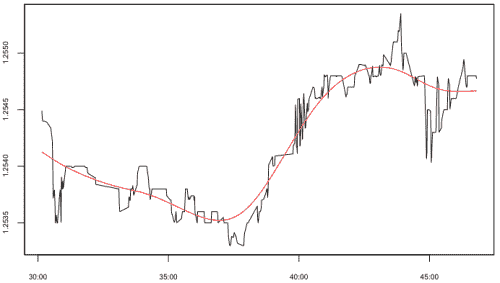

<!--yml
category: 未分类
date: 2024-05-18 15:38:03
-->

# Trade Exit Strategy | Tr8dr

> 来源：[https://tr8dr.wordpress.com/2009/11/10/trade-exit-strategy/#0001-01-01](https://tr8dr.wordpress.com/2009/11/10/trade-exit-strategy/#0001-01-01)

I’ve not put all that much focus on trade exit strategies as usually have relied on trading signal to determine when to reverse a position (in addition to various risk related parameters).   I have a situation, now, where I need to determine the exit independent of the signal.   Thus will need to make an exit decision based on other criteria.

As the saying goes, “cut your losses short and let your profits run”.   As simple as this sounds is not necessarily simple to implement.   Any given price path will have “retracements”, i.e. price will not move in a monotonic fashion.    So how does one set the “trigger” to exit the trade such that can ride over “retracement” noise towards more profit?

**Standard Practice** Standard practice is to use a variety of indicators to determine when to exit a profitable trade:

1.  retracement as % of “volatility” (recent trading range)
    Using recent trading ranges (a proxy to variance) to scale the amount of retracement can work well in certain conditions.
2.  arbitrary limits: max profit, maximum trade time
    We may have a view around maximum time or profit opportunity for a strategy, allowing us to avoid a later drawdown to signal our exit.
3.  various technical indicators

**Some Problems**
When trading intra-day observing the market tick-to-tick, the above rules do not work well.   High frequency data has many short-lived high-amplitude spikes (high relative to typical price movements).  This is particularly evident in periods of the trading day with lower liquidity.

Whereas recent trading ranges usually provide a reasonable view on the current period’s noise level for medium-low frequency data, the same is not generally true for high frequency.

**Optimal Approach** An optimal approach to the problem is to use a price path model where we can determine the probability of a retracement swinging back in the direction of profit;  Or for that matter, determine the probability of subsequent price action retracing prior to any significant retracement.    Such a model cannot possibly be right all of the time, but done successfully will have a significant edge over even odds.

The price path model provides the probability of a price going through a level at time t.  Given that can ask:

*   what is the probability of the price going through a level within a time period
*   what is the probability of the price remaining within a corridor within a time period

The above allow us to make optimal exit decisions based on risk considerations (the corridor) and likely (or unlikely) movement in the positive direction.

Embedded in such a model, though, is an accurate view on the price process within a near window, a view and a strategy in its own right.

I developed a general calibration and prediction framework for the price path model, however, the price process SDE needs more work (although it shows good predictive behavior in certain market conditions, does not handle all well as of yet).   Are there better alternatives for the short-term?

**Mean-Reversion Collar** Short of a semi-predictive probabalistic model the next best thing might be to make use of our recently developed mean-reversion envelope.   The envelope can be tuned to various cycle periods and amplitudes.

Noise exhibits as a mean-reverting process around some evolving mean.   We can tune the envelope to encompass the level of noise we wish to ignore.   The projected mean therefore indicates the overall direction of price on average.    We can use this then to determine whether to carry the trade forward through a retracement or not.

