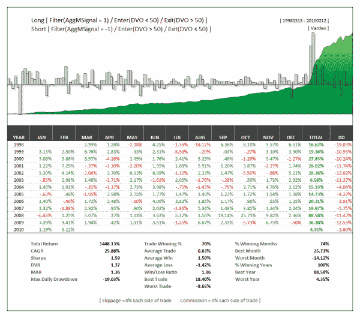

<!--yml
category: 未分类
date: 2024-05-12 18:35:58
-->

# Trade With The Trend: Using AggM as a Filter for Short-term Mean Reversion Indicators | CSSA

> 来源：[https://cssanalytics.wordpress.com/2010/02/17/trade-with-the-trend-using-aggm-as-a-filter-for-short-term-mean-reversion-indicators/#0001-01-01](https://cssanalytics.wordpress.com/2010/02/17/trade-with-the-trend-using-aggm-as-a-filter-for-short-term-mean-reversion-indicators/#0001-01-01)

In this example, we only permitted trades in the direction of the trend as defined by AggM (DVAM)which is a composite trend/mean-reversion indicator available at [www.dvindicators.com](http://www.dvindicators.com).  Long trades were triggered when AggM rose above 65 and ended when AggM closed below 35.  During this time period, we traded DVO from the long side only, going  long<50, exiting above 50\. Short trades began when AggM fell below 35, and were closed above 65\. During this time period we traded DVO from the short side only, going short>50 and exiting below 50\. Excluding 1998, this strategy produced strong returns and  very low drawdowns on average. This method works well with other indicators including RSI2 as well.

