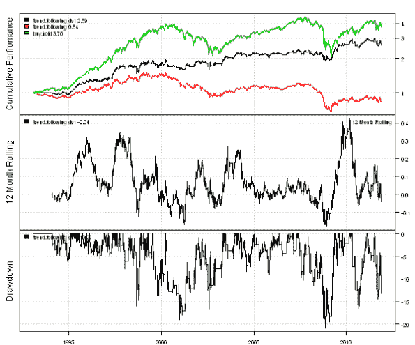
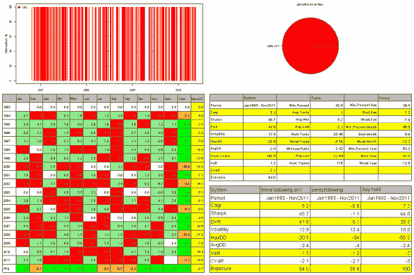
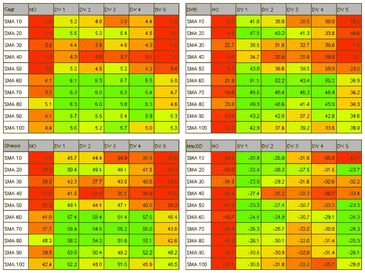

<!--yml
category: 未分类
date: 2024-05-18 14:45:34
-->

# Trading Strategy Sensitivity Analysis | Systematic Investor

> 来源：[https://systematicinvestor.wordpress.com/2011/11/29/trading-strategy-sensitivity-analysis/#0001-01-01](https://systematicinvestor.wordpress.com/2011/11/29/trading-strategy-sensitivity-analysis/#0001-01-01)

When designing a trading strategy, I want to make sure that small changes in the strategy parameters will not transform the profitable strategy into the loosing one. I will study the strategy robustness and profitability under different parameter scenarios using a sample strategy presented by David Varadi in the [Improving Trend-Following Strategies With Counter-Trend Entries](http://cssanalytics.wordpress.com/2011/07/29/improving-trend-following-strategies-with-counter-trend-entries/) post.

First, let’s implement this trend-following strategy using the backtesting library in the [Systematic Investor Toolbox](https://systematicinvestor.wordpress.com/systematic-investor-toolbox/):

```

# Load Systematic Investor Toolbox (SIT)
setInternet2(TRUE)
con = gzcon(url('https://github.com/systematicinvestor/SIT/raw/master/sit.gz', 'rb'))
	source(con)
close(con)

	#*****************************************************************
	# Load historical data
	#****************************************************************** 
	load.packages('quantmod')
	tickers = spl('SPY')

	data <- new.env()
	getSymbols(tickers, src = 'yahoo', from = '1970-01-01', env = data, auto.assign = T)
	bt.prep(data, align='keep.all', dates='1970::2011')

	#*****************************************************************
	# Code Strategies
	#****************************************************************** 
	prices = data$prices    

	# Buy & Hold	
	data$weight[] = 1
	buy.hold = bt.run(data)	

	# Trend-Following strategy: Long[Close > SMA(10) ]
	sma = bt.apply(data, function(x) { SMA(Cl(x), 10) } )	
	data$weight[] = NA
		data$weight[] = iif(prices >= sma, 1, 0)
	trend.following = bt.run(data, trade.summary=T)			

	# Trend-Following With Counter-Trend strategy: Long[Close > SMA(10), DVB(1) CounterTrend ]
	dv = bt.apply(data, function(x) { DV(HLC(x), 1, TRUE) } )	
	data$weight[] = NA
		data$weight[] = iif(prices > sma & dv < 0.25, 1, data$weight)
		data$weight[] = iif(prices < sma & dv > 0.75, 0, data$weight)
	trend.following.dv1 = bt.run(data, trade.summary=T)			

	#*****************************************************************
	# Create Report
	#****************************************************************** 
	plotbt.custom.report(trend.following.dv1, trend.following, buy.hold)	

```

[](https://systematicinvestor.wordpress.com/wp-content/uploads/2011/11/plot1-small9.png)

[](https://systematicinvestor.wordpress.com/wp-content/uploads/2011/11/plot2-small8.png)

The Counter-Trend Entries (trend.following.dv1, black line) improved the performance of the simple Trend-Following (trend.following, red line) strategy: both returns are higher and drawdowns are smaller.

Next, I will examine how CAGR, Sharpe, DVR, and Maximum Drawdowns are affected by varying length of the moving average from 10 to 100 and varying length of the DV from 1 to 5:

```

	#*****************************************************************
	# Sensitivity Analysis
	#****************************************************************** 
	ma.lens = seq(10, 100, by = 10)
	dv.lens = seq(1, 5, by = 1)

	# precompute indicators
	mas = matrix(double(), nrow(prices), len(ma.lens))
	dvs = matrix(double(), nrow(prices), len(dv.lens))

	for(i in 1:len(ma.lens)) {
		ma.len = ma.lens[i]
		mas[, i] = bt.apply(data, function(x) { SMA(Cl(x), ma.len) } )
	}
	for(i in 1:len(dv.lens)) {
		dv.len = dv.lens[i]
		dvs[,i] = bt.apply(data, function(x) { DV(HLC(x), dv.len, TRUE) } )
	}

	# allocate matrixes to store backtest results
	dummy = matrix(double(), len(ma.lens), 1+len(dv.lens))
		rownames(dummy) = paste('SMA', ma.lens)
		colnames(dummy) = c('NO', paste('DV', dv.lens))

	out = list()
		out$Cagr = dummy
		out$Sharpe = dummy
		out$DVR = dummy
		out$MaxDD = dummy

	# evaluate strategies
	for(ima in 1:len(ma.lens)) {
		sma = mas[, ima]
		cat('SMA =', ma.lens[ima], '\n')

		for(idv in 0:len(dv.lens)) {			
			if( idv == 0 ) {
				data$weight[] = NA
					data$weight[] = iif(prices > sma, 1, 0)			
			} else {
				dv = dvs[, idv]

				data$weight[] = NA
					data$weight[] = iif(prices > sma & dv < 0.25, 1, data$weight)
					data$weight[] = iif(prices < sma & dv > 0.75, 0, data$weight)
			}
			strategy = bt.run(data, silent=T)

			# add 1 to account for benchmark case, no counter-trend
			idv = idv + 1
			out$Cagr[ima, idv] = compute.cagr(strategy$equity)
			out$Sharpe[ima, idv] = compute.sharpe(strategy$ret)
			out$DVR[ima, idv] = compute.DVR(strategy)
			out$MaxDD[ima, idv] = compute.max.drawdown(strategy$equity)
		}
	}

	#*****************************************************************
	# Create Report
	#****************************************************************** 
	layout(matrix(1:4,nrow=2))	
	for(i in names(out)) {
		temp = out[[i]]
		temp[] = plota.format( 100 * temp, 1, '', '' )
		plot.table(temp, smain = i, highlight = T, colorbar = F)
	}

```

[](https://systematicinvestor.wordpress.com/wp-content/uploads/2011/11/plot3-small6.png)

The first column, labeled “NO”, shows the performance of the Trend-Following strategy (no Counter-Trend Entries). The Counter-Trend filter improves the strategy performance for most of the parameter scenarios. This is the result you want to get by doing Sensitivity Analysis, the strategy is robust and profitable under variety of parameters.

The next step, which you can do as a homework, is to examine the strategy performance with different instruments. For example, a more volatile Nasdaq (QQQ), or a Canadian S&P/TSX Index (XIU.TO).

To view the complete source code for this example, please have a look at the [bt.improving.trend.following.test() function in bt.test.r at github](https://github.com/systematicinvestor/SIT/blob/master/R/bt.test.r).