<!--yml
category: 未分类
date: 2024-05-18 13:53:55
-->

# Trading the Unobservable | Quantivity

> 来源：[https://quantivity.wordpress.com/2010/02/15/trading-the-unobservable/#0001-01-01](https://quantivity.wordpress.com/2010/02/15/trading-the-unobservable/#0001-01-01)

Security prices are driven by diverse factors and constraints, many of which are neither directly observable nor quantifiable by traders. Examples includes fundamental (*e.g.* corporate actions), behavioral (*e.g.* herd mentality), financial (*e.g.* liquidity), macro (*e.g.* central bank intervention), and microstructure (*e.g.* market impact algos). Yet, many classic quant models are formulated exclusively using variables which are directly observed: quotes, trades, prices, volumes, spreads, *etc*.

*This is an odd contradiction*.

Unraveling this contradiction is central to exploring [market regimes](https://quantivity.wordpress.com/2009/12/31/market-regime-trading-redux/), as they defy characterization by observable variables.

A short detour through a bit of mathematical intuition helps illustrate this contradiction and point a way towards potential solutions not found in classic time series statistics. Consider the price 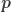 for any security at tick time 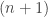:

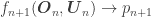

In other words, the price of the security at time  is determined by some function 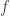 of observed (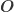) and unobserved (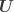) variables evaluated during the preceding time 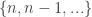. Admittedly, an apparent [tautology](http://en.wikipedia.org/wiki/Tautology_%28rhetoric%29) if there ever was. Yet, from this simple equivalence, we can highlight the *a priori* constraints imposed by traditional time-series quant models:

*   Probabilistic: the future cannot be predicted with certainty, thus  are assumed to be probabilistic, usually drawing from a single distribution 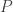 (usually analytically tractable)
*   [Independent and identically-distributed](http://en.wikipedia.org/wiki/Independent_and_identically-distributed_random_variables) (i.i.d): values of  are drawn from , and assumed to be i.i.d.
*   Observability: unobservable variables are excluded (since they cannot be quantified), thus 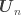 is omitted (*i.e.* empty set 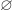)
*   [Statistical significance](http://en.wikipedia.org/wiki/Statistical_significance): achieving statistical significance requires a minimum set of observations, thus  is commonly assumed the same for long contiguous sequences of , if not all  (*i.e.* 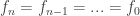)

These constraints are compounded by two unfortunate facts:

*   Unknown : the true function  is not known to the model, as it is unknowable
*   Lack of objective function: there is no quantitative way to know how to improve any given model relative to , as  is unknown

Which result in the following methodological problems, when seeking to choose one quant model in favor of another for purposes of profitable trading:

Yet, not all is lost. There is a beautiful mathematical trick:

![g_{n}(\boldsymbol{O}_{n}) \rightarrow \boldsymbol{Z_{n}}  \\[7px] f_{n+1}(\boldsymbol{O}_{n}, \boldsymbol{Z}_{n}) \rightarrow p_{n+1}](img/8fd2effbcfd1fcd9cf2b5a3f70f03461.png)

Where 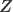 are *unobserved variables* (usually estimated in a [state space](http://en.wikipedia.org/wiki/State_space_%28controls%29)) and the system is evaluated with [Bayesian inference](evaluate%20the%20following%20under%20Bayesian%20inference).

This trick is conceptually simple, yet manifests in myriad elegant ways from [hidden markov models](http://en.wikipedia.org/wiki/Hidden_Markov_Models) and [principle components](http://en.wikipedia.org/wiki/Principal_component_analysis) to [Kalman](http://en.wikipedia.org/wiki/Kalman_filter) / [particle](http://en.wikipedia.org/wiki/Particle_filter) filters and [state space models](http://en.wikipedia.org/wiki/State_space_%28controls%29). So many ways, in fact, the fledgling discipline of [machine learning](http://en.wikipedia.org/wiki/Machine_learning) is seeking to unify them.

Yet, machine learning (ML) remains shrouded in mystery and corresponding intrigue for many traders. Although numerous causes may be root, two seem to regularly stand out:

Or, as summed up nicely by [Gappy](http://www.twitter.com/gappy3000) in a recent [post comment](https://quantivity.wordpress.com/2010/01/10/how-to-learn-algorithmic-trading/#comments); many modern quantitative trading techniques:

> “Take too long to learn how to apply the concepts well, and it’s all too easy to misapply them.”

Given understanding [market regimes](https://quantivity.wordpress.com/2009/12/31/market-regime-trading-redux/) depends in part upon quantifying the unobservable, a subsequent series of posts will seek to illuminate selected ML techniques. Motivated by the above discussion, the first post in this series will introduce two elegant and ubiquitous workhorses of machine learning: expectation maximization and the Kullback-Leibler divergence.