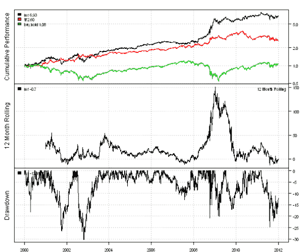
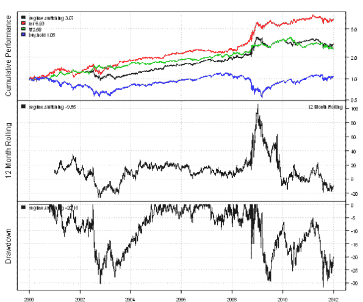
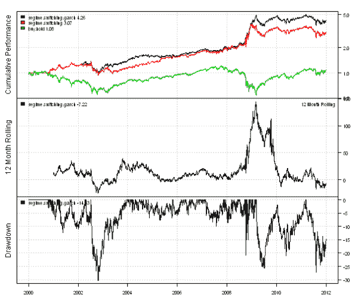

<!--yml
category: 未分类
date: 2024-05-18 14:44:03
-->

# Trading using Garch Volatility Forecast | Systematic Investor

> 来源：[https://systematicinvestor.wordpress.com/2012/01/06/trading-using-garch-volatility-forecast/#0001-01-01](https://systematicinvestor.wordpress.com/2012/01/06/trading-using-garch-volatility-forecast/#0001-01-01)

[Quantum Financier](http://quantumfinancier.wordpress.com) wrote an interesting article [Regime Switching System Using Volatility Forecast](http://quantumfinancier.wordpress.com/2010/08/27/regime-switching-system-using-volatility-forecast/). The article presents an elegant algorithm to switch between mean-reversion and trend-following strategies based on the market volatility. Two model are examined: one using the historical volatility and another using the Garch(1,1) Volatility Forecast. The mean-reversion strategy is modeled with RSI(2): Long when RSI(2), and Short otherwise. The trend-following strategy is modeled with SMA 50/200 crossover: Long when SMA(50) > SMA(200), and Short otherwise.

I want show how to implement these ideas using the backtesting library in the [Systematic Investor Toolbox](https://systematicinvestor.wordpress.com/systematic-investor-toolbox/).

Following code loads historical prices from Yahoo Fiance and compares performance of the Buy and Hold, Mean-Reversion, and Trend-Following strategies using the backtesting library in the [Systematic Investor Toolbox](https://systematicinvestor.wordpress.com/systematic-investor-toolbox/):

```

###############################################################################
# Load Systematic Investor Toolbox (SIT)
###############################################################################
con = gzcon(url('http://www.systematicportfolio.com/sit.gz', 'rb'))
    source(con)
close(con)

	#*****************************************************************
	# Load historical data
	#****************************************************************** 
	load.packages('quantmod')	
	tickers = 'SPY'

	data <- new.env()
	getSymbols(tickers, src = 'yahoo', from = '1970-01-01', env = data, auto.assign = T)
		for(i in ls(data)) data[[i]] = adjustOHLC(data[[i]], use.Adjusted=T)		
	bt.prep(data, align='remove.na', dates='2000::2012')

	#*****************************************************************
	# Code Strategies
	#****************************************************************** 
	prices = data$prices  
	n = len(tickers)  
	nperiods = nrow(prices)

	# Buy & Hold	
	data$weight[] = 1
	buy.hold = bt.run(data)	

	# Mean-Reversion(MR) strategy - RSI2
	rsi2 = bt.apply.matrix(prices, RSI, 2)
	data$weight[] = NA
		data$weight[] = iif(rsi2 < 50, 1, -1)	
		capital = 100000
		data$weight[] = (capital / prices) * bt.exrem(data$weight)
	mr = bt.run(data, type='share', capital=capital, trade.summary=T)

	# Trend Following(TF) strategy - MA 50/200 crossover
	sma.short = bt.apply.matrix(prices, SMA, 50)
	sma.long = bt.apply.matrix(prices, SMA, 200)
	data$weight[] = NA
		data$weight[] = iif(sma.short > sma.long, 1, -1)
		capital = 100000
		data$weight[] = (capital / prices) * bt.exrem(data$weight)
	tf = bt.run(data, type='share', capital=capital, trade.summary=T)

	#*****************************************************************
	# Create Report
	#****************************************************************** 
	plotbt.custom.report.part1(mr, tf, buy.hold)

```

[](https://systematicinvestor.wordpress.com/wp-content/uploads/2012/01/plot1-small.png)

Next, let’s create a strategy that switches between mean-reversion and trend-following strategies based on historical market volatility.

```

	#*****************************************************************
	# Regime Switching based on historical market volatility
	# Classify current volatility by percentile using a 252 day look-back period
	# percentrank(MA(percentrank(Stdev( diff(log(close)) ,21),252),21),250)
	#****************************************************************** 
	ret.log = bt.apply.matrix(prices, ROC, type='continuous')
	hist.vol = bt.apply.matrix(ret.log, runSD, n = 21)
	vol.rank = percent.rank(SMA(percent.rank(hist.vol, 252), 21), 250)

	# Regime Switching Historical
	data$weight[] = NA
		data$weight[] = iif(vol.rank > 0.5, 
					iif(rsi2 < 50, 1, -1),
					iif(sma.short > sma.long, 1, -1)
				)
		capital = 100000
		data$weight[] = (capital / prices) * bt.exrem(data$weight)
	regime.switching = bt.run(data, type='share', capital=capital, trade.summary=T)

	#*****************************************************************
	# Create Report
	#****************************************************************** 
	plotbt.custom.report.part1(regime.switching, mr, tf, buy.hold)

```

[](https://systematicinvestor.wordpress.com/wp-content/uploads/2012/01/plot2-small.png)

Next, let’s create a GARCH(1,1) Volatility Forecast. I would recommend reading following articles for anyone who wants to find what GARCH is all about or to refresh their knowledge:

There are a few R packages to fit GARCH models. I will consider garch function from tseries package and garchFit function from fGarch package. The garch function from tseries package is fast but does not always find solution. The garchFit function from fGarch package is slower but does converge more consistently. To demonstrate the speed difference between garch function and garchFit function I created a simple benchmark:

```

	#*****************************************************************
	# Benchmarking Garch algorithms 
	#****************************************************************** 
	load.packages('tseries,fGarch,rbenchmark')	
	temp = garchSim(n=252)

	test1 <- function() {
		fit1=garch(temp, order = c(1, 1), control = garch.control(trace = F))
	}
	test2 <- function() {
		fit2=garchFit(~ garch(1,1), data = temp, include.mean=FALSE, trace=F)
	}

	benchmark(
		test1(),
		test2(),
		columns=spl('test,replications,elapsed,relative'),
		order='relative',
		replications=100
	)

```

The garchFit function is on average 6 times slower than garch function. So to forecast volatility I will try to use garch function whenever it can find a solution and garchFit function otherwise.

```

	#*****************************************************************
	# Forecast Volatility using Garch	
	# garch from tseries is fast, but does not consistently converge
	# garchFit from fGarch is slower, but converges consistently
	#****************************************************************** 
	load.packages('tseries,fGarch')	

	# Sigma[t]^2 = w + a* Sigma[t-1]^2 + b*r[t-1]^2
	garch.predict.one.day <- function(fit, r.last) 
	{
		h.last = tail( fitted(fit)[,1] ,1)			
		sqrt(sum( coef(fit) * c(1,  r.last^2, h.last^2) ))	
	}

	# same as predict( fit, n.ahead=1, doplot=F)[3]
	garchFit.predict.one.day <- function(fit, r.last) 
	{
		h.last = tail(sqrt(fit@h.t), 1)
		sqrt(sum( fit@fit$matcoef[,1] * c(1,  r.last^2, h.last^2) ))
	}

	garch.vol = NA * hist.vol
	for( i in (252+1):nperiods ) {
		temp = as.vector(ret.log[ (i-252+1):i, ])
		r.last =  tail( temp, 1 )

		fit = tryCatch( garch(temp, order = c(1, 1), control = garch.control(trace = F)),
	    				error=function( err ) FALSE, warning=function( warn ) FALSE )

		if( !is.logical( fit ) ) {
			if( i == 252+1 ) garch.vol[1:252] = fitted(fit)[,1]
			garch.vol[i] = garch.predict.one.day(fit, r.last)
		} else {
			fit = tryCatch( garchFit(~ garch(1,1), data = temp, include.mean=FALSE, trace=F),
	    				error=function( err ) FALSE, warning=function( warn ) FALSE )

			if( !is.logical( fit ) ) {
				if( i == 252+1 ) garch.vol[1:252] = sqrt(fit@h.t)
				garch.vol[i] = garchFit.predict.one.day(fit, r.last)
			} 
		}			
		if( i %% 100 == 0) cat(i, '\n')
	}
	garch.vol = ifna.prev(garch.vol)

```

Now, let’s create a strategy that switches between mean-reversion and trend-following strategies based on GARCH(1,1) volatility forecast.

```

	#*****************************************************************
	# Regime Switching using Garch
	#****************************************************************** 		
	vol.rank = percent.rank(SMA(percent.rank(garch.vol, 252), 21), 250)

	# Regime Switching Garch
	data$weight[] = NA
		data$weight[] = iif(vol.rank > 0.5, 
					iif(rsi2 < 50, 1, -1),
					iif(sma.short > sma.long, 1, -1)
				)
		capital = 100000
		data$weight[] = (capital / prices) * bt.exrem(data$weight)
	regime.switching.garch = bt.run(data, type='share', capital=capital, trade.summary=T)	

	#*****************************************************************
	# Create Report
	#****************************************************************** 
	plotbt.custom.report.part1(regime.switching.garch, regime.switching, buy.hold)

```

[](https://systematicinvestor.wordpress.com/wp-content/uploads/2012/01/plot3-small.png)

The switching strategy that uses GARCH(1,1) volatility forecast performed slightly better than the one that uses historical volatility.

There many different approaches you can take to incorporate forecasting into your models and trading strategies. R has a very rich set of packages to model and forecast time series. Here are some examples that I found interesting:

To view the complete source code for this example, please have a look at the [bt.volatility.garch() function in bt.test.r at github](https://github.com/systematicinvestor/SIT/blob/master/R/bt.test.r).