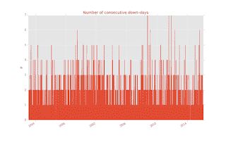
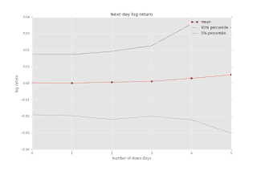
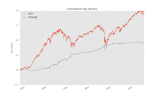

<!--yml
category: 未分类
date: 2024-05-18 15:42:01
-->

# Trading with Python: A simple statistical edge in SPY

> 来源：[http://tradingwithpython.blogspot.com/2016/02/a-simple-statistical-edge-in-spy.html#0001-01-01](http://tradingwithpython.blogspot.com/2016/02/a-simple-statistical-edge-in-spy.html#0001-01-01)

I've recently read a great post by the turinginance blog on

[how to be a quant](http://www.turingfinance.com/how-to-be-a-quant/)

.  In short, it describes a scientific approach to developing trading strategies. For me personally, observing data, thinking with models and forming hypothesis is a second nature, as it should be for any good engineer.

In this post I'm going to illustrate this approach by explicitly going through a number of steps (just a couple, not all of them) involved in development of a trading strategy.

Let's take a look at the most common trading instrument, the S&P 500 ETF  'SPY' . I'll start with observations.

**Observations**

It occurred to me that most of the time that there is much talk in the media about the market crashing (after big losses over several days timespan), quite a significant rebound sometimes follows.

In the past I've made a couple of mistakes by closing my positions to cut losses short, just to miss out a recovery in the following days.

**General theory**

After a period of consecutive losses, many traders will liquidate their positions out of fear for even larger loss. Much of this behavior is governed by fear, rather than calculated risk. Smarter traders come in then for the bargains.

**Hypothesis:**

Next-day returns of SPY will show an upward bias after a number of consecutive losses.

To test the hypothesis, I've calculated the number of consecutive 'down' days . Everything under -0.1% daily return qualifies as a 'down' day.

The return series are near-random, so as one would expect, the chances of 5 or more consecutive down days are low, resulting in a very limited number of occurrences. Low number of occurrences will result in unreliable statistical estimates, so I'll stop at 5.

Below is a visualisation of nex-tday returns as a function of number of down days.

I've also plotted 90% confidence interval of the returns between the lines. It turns out that the average return *is* positively correlated with the number of down days. Hypothesis

**confirmed**

.

However, you can clearly see that this extra

*alpha*

 is very small compared to the band of the probable return outcomes. But even a tiny edge can be exploited (find a statistical advantage and repeat as often as possible). Next step is to investigate if this edge can be turned in a trading strategy.

Given the data above, a trading strategy can be forumlated:

**After consectutive 3 or more losses, go long. Exit on next close.**

Below is a result of this strategy compared to pure buy-and-hold.

This does not look bad at all! Looking a the sharpe ratios the strategy scores a descent 2.2 versus 0.44 for the B&H.  This is actually pretty good!  ( don't get too excited though, as I did not account for commision costs, slippage etc ).

While the strategy above is not something that I would like to trade simply because of the long time span, the theory itself provokes futher thoughts that could produce something useful. If the same principle applies to intraday data, a form of scalping strategy could be built. In the example above I've oversimplified the world a bit by only counting the *number* of down days, without paying attention to the depth of the drawdown. Also, position exit is just a basic 'next-day-close' . There is much to be improved, but the essence in my opinion is this:

*future returns of SPY are ifluenced by drawdown and drawdown duration over the previous 3 to 5 days.*