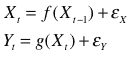
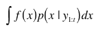
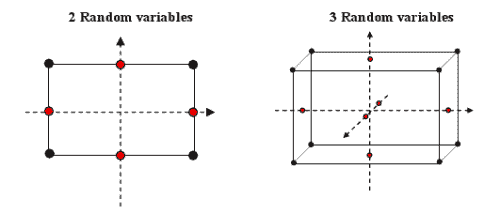
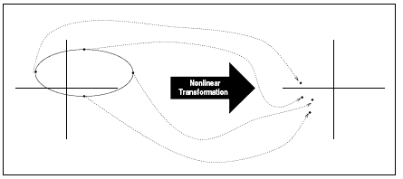
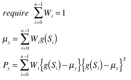
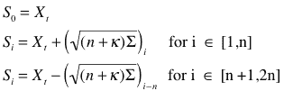

<!--yml
category: 未分类
date: 2024-05-18 15:29:50
-->

# Unscented Transform & Filters | Tr8dr

> 来源：[https://tr8dr.wordpress.com/2011/07/28/unscented-transform-filters/#0001-01-01](https://tr8dr.wordpress.com/2011/07/28/unscented-transform-filters/#0001-01-01)

The unscented transform (and filter) was developed as a practical alternative to MC sampling in estimating the conditional distribution functions of hidden state systems.   We want to determine the hidden state (Xt)  given observations (Yt):

The  Sequential MC approach to determining this distribution p(Xt | Y1:t) is calculated as folows:

This works for us, since we know the observations y[1:t] and we should have a view on the likelihood of state X given Y by projecting samples of X into Y via function g(.).   There are various approaches to determining the likelihood and reducing the number of particles (samples) required to arrive at a robust integration (such as SIR).

The basic MC particle sampling algorithm is as follows:

1.  generate N samples of X[t],i from f (X[t-1] + noise), transformed from X[t-1] to X[t] via that f(.) function
2.  determine “particles” as p(Yt | X'[t],i) / normalizing constant, where p(Yt|Xt) can be determined by applying function g(x) and determining likelihood of computed Yt given Xt.
3.  some resampling and kernel weighted selection may occur, depending on algorithm
4.  Mean is then the probability weighted average of the Xt’s (as indicated in the above integral)

I’ve implemented and used a number of variations of these in the past.   MC approaches are unavoidable for complex distributions (for instance ones that are multi-modal).   That said particle filters can be orders of magnitude slower than the Kalman family of filters.

**Unscented Transform** Enter the unscented transform.   Much as with the SMC approach, the unscented transform uses sampling to determine the mean and higher-order moments of the distribution: p(x[t] | y[1:t]).   Instead of generating numerous random samples, the unscented approach is to take samples at specific points around the current mean.

The unscented approach also avoids approximating the non-linearity of  system functions, instead looks to determine the simpler problem of approximating the distribution.  2^d + 1 sample (or sigma) points are determined around the mean and transformed through the non-linear functions to arrive at a view of the distribution of the state vector.

As illustrated in Julier and Uhlmann’s 1997 seminal paper:

The sigma points determined around the mean (Si and with associated weights Wi), are transformed through the non-linear system function allowing us to determine the moments of the distribution p(μ, P), with mean μ and covariance P (higher order moments can be computed as well):

It then becomes a question of how to select these sigma points Si around the mean Xt.   We know that we want to choose Si = Xt + Ei, where each vector Ei provides an appropriate spread in a given dimension, along the orientation of the distribution.  If these points are well chosen, will provide enough information to reconstruct moments of the distribution.

Under the assumption that Xt (pre-transform) is elliptically distributed, it turns out that the column vectors of the Cholesky decomposition of the covariance matrix specify vectors co-linear with the axes of the distribution.   These are determined and scaled as follows:

For more detail read the following [paper](http://www.google.com/url?sa=t&source=web&cd=1&sqi=2&ved=0CBUQFjAA&url=http%3A%2F%2Fciteseerx.ist.psu.edu%2Fviewdoc%2Fdownload%3Fdoi%3D10.1.1.46.8107%26rep%3Drep1%26type%3Dpdf&ei=Xq8xTo3UNcKcgQe6quH5DA&usg=AFQjCNHo8y-X15XiCLoWuN3dkgrxCE55Tg&sig2=IpOnVHReCpwtSWEEUmqI2g "A Consisten, Debiased Method for Converting Bteween Polar and Cartesian Coordinates").

**Why the UKF**?
The typical implementation of the EKF uses a linear (and sometimes quadratic) approximation in the update of the distributions.  This can fail spectacularly (or just present significant error) unless your system is well behaved through 1st order dynamics.   The UKF approach also does not require calculation of Jacobian or Hessian matrices, which for some problems may be extremely difficult or impossible to provide.

**Next Step** I am particularly interested in the forward-backward UTF with smoothing.   I have found that smoothing on the priors (not just the immediate t-1) provides a better forecast for the current and next periods.   Will write more about this next.