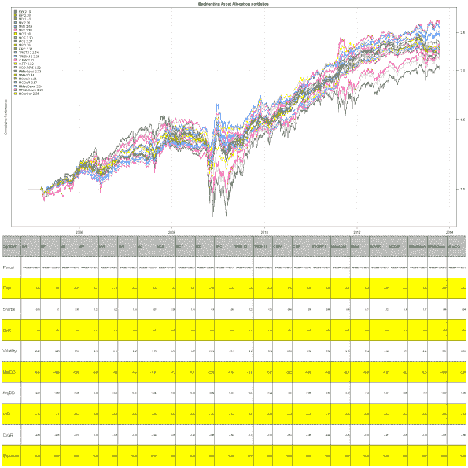

<!--yml
category: 未分类
date: 2024-05-18 14:29:32
-->

# Update for Backtesting Asset Allocation Portfolios post | Systematic Investor

> 来源：[https://systematicinvestor.wordpress.com/2013/10/24/update-for-backtesting-asset-allocation-portfolios-post/#0001-01-01](https://systematicinvestor.wordpress.com/2013/10/24/update-for-backtesting-asset-allocation-portfolios-post/#0001-01-01)

It was over a year since my original post, [Backtesting Asset Allocation portfolios](https://systematicinvestor.wordpress.com/2012/03/19/backtesting-asset-allocation-portfolios/). I have expanded the functionality of the [Systematic Investor Toolbox](https://systematicinvestor.wordpress.com/systematic-investor-toolbox/) both in terms of optimization functions and helper back-test functions during this period.

Today, I want to update the [Backtesting Asset Allocation portfolios](https://systematicinvestor.wordpress.com/2012/03/19/backtesting-asset-allocation-portfolios/) post and showcase new functionality. I will use the following global asset universe as: SPY,QQQ,EEM,IWM,EFA,TLT,IYR,GLD to form portfolios every month using different asset allocation methods.

```

###############################################################################
# Load Systematic Investor Toolbox (SIT)
# https://systematicinvestor.wordpress.com/systematic-investor-toolbox/
###############################################################################
setInternet2(TRUE)
con = gzcon(url('http://www.systematicportfolio.com/sit.gz', 'rb'))
    source(con)
close(con)

	#*****************************************************************
	# Load historical data
	#****************************************************************** 
	load.packages('quantmod,quadprog,corpcor,lpSolve')
	tickers = spl('SPY,QQQ,EEM,IWM,EFA,TLT,IYR,GLD')

	data <- new.env()
	getSymbols(tickers, src = 'yahoo', from = '1980-01-01', env = data, auto.assign = T)
		for(i in ls(data)) data[[i]] = adjustOHLC(data[[i]], use.Adjusted=T)							
	bt.prep(data, align='remove.na', dates='1990::') 

	#*****************************************************************
	# Code Strategies
	#****************************************************************** 					
	cluster.group = cluster.group.kmeans.90

	obj = portfolio.allocation.helper(data$prices, 
		periodicity = 'months', lookback.len = 60, 
		min.risk.fns = list(
			EW=equal.weight.portfolio,
			RP=risk.parity.portfolio(),
			MD=max.div.portfolio,						

			MV=min.var.portfolio,
			MVE=min.var.excel.portfolio,
			MV2=min.var2.portfolio,

			MC=min.corr.portfolio,
			MCE=min.corr.excel.portfolio,
			MC2=min.corr2.portfolio,

			MS=max.sharpe.portfolio(),
			ERC = equal.risk.contribution.portfolio,

			# target retunr / risk
			TRET.12 = target.return.portfolio(12/100),								
			TRISK.10 = target.risk.portfolio(10/100),

			# cluster
			C.EW = distribute.weights(equal.weight.portfolio, cluster.group),
			C.RP = distribute.weights(risk.parity.portfolio, cluster.group),

			# rso
			RSO.RP.5 = rso.portfolio(risk.parity.portfolio, 5, 500), 

			# others
			MMaxLoss = min.maxloss.portfolio,
			MMad = min.mad.portfolio,
			MCVaR = min.cvar.portfolio,
			MCDaR = min.cdar.portfolio,
			MMadDown = min.mad.downside.portfolio,
			MRiskDown = min.risk.downside.portfolio,
			MCorCov = min.cor.insteadof.cov.portfolio
		)
	)

	models = create.strategies(obj, data)$models

	#*****************************************************************
	# Create Report
	#******************************************************************    
	strategy.performance.snapshoot(models, T, 'Backtesting Asset Allocation portfolios')

```

[](https://systematicinvestor.wordpress.com/wp-content/uploads/2013/10/plot1.png)

I hope you will enjoy creating your own portfolio allocation methods or playing with a large variety of portfolio allocation techniques that are readily available for your experimentation.

To view the complete source code for this example, please have a look at the [bt.aa.test.new() function in bt.test.r at github](https://github.com/systematicinvestor/SIT/blob/master/R/bt.test.r).