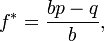

<!--yml
category: 未分类
date: 2024-05-12 18:51:03
-->

# Using Contingent Probabilities and the Kelly Criterion for Trade Management | CSSA

> 来源：[https://cssanalytics.wordpress.com/2009/08/07/using-contingent-probabilities-and-the-kelly-criterion-for-trade-management/#0001-01-01](https://cssanalytics.wordpress.com/2009/08/07/using-contingent-probabilities-and-the-kelly-criterion-for-trade-management/#0001-01-01)

The Kelly Criterion is truly a hidden gem, largely because it directly contradicts the mean-variance utility framework of Modern Portfolio Theory (MPT). The high priests of modern finance have suppressed this practical decision tool to protect their own devices, which is good –because it gives you an edge on the competition.

The purpose of the Kelly Criterion is to maximize the compound return, while leaving the probability of going broke equal to zero. Initially, it was used by blackjack players to determine how much to bet when they counted cards. When the count was high, they would have a higher expectation and would bet more. But the amount to bet was critical, because in actuality, the edge that a card counter has is actually quite small. It can vary between 52/48  for the player to 55/45 when the deck is loaded with tens and aces (depending on the # of decks, BJ odds etc). Ironically the odds in the stock market for daily follow through (betting on an up day after a down day and vice versa)  are nearly identical, while the payoff is much smaller than doubling your bet every day. The Kelly Criterion is as follows:

For simple bets with two outcomes, one involving losing the entire amount bet, and the other involving winning the bet amount multiplied by the payoff [odds](https://cssanalytics.wordpress.com/wiki/Odds "Odds"), the Kelly bet is (from Wikpedia [http://en.wikipedia.org/wiki/Kelly_criterion](http://en.wikipedia.org/wiki/Kelly_criterion)) :

where

*   *f** is the fraction of the current bankroll to wager;
*   *b* is the net odds received on the wager (that is, odds are usually quoted as “*b* to 1″)
*   *p* is the probability of winning;
*   *q* is the probability of losing, which is 1 − *p*.

Note that one of the important hitches in applying the kelly criterion to the market is that it was designed assuming that if you lose the entire wager is lost. From this perspective, it can be applied directly to options, but it  must be modified for practical use. You can theoretically never lose all your money by investing in the S&P500 for the next day. Before i get into contingent probabilities, lets discuss how I like to do this modification. First i divide the market into two states: 1) a bull market 2) a bear market. I establish this by determining whether the 252-day average is rising, that is if the 252-day average of SPY prices is greater than the day before, we are in a bull market. If the average is falling we are in a bear market. I compute the average daily price return and the probability of winning versus losing for each state. Here are the results on the SPY for the last 4000 bars:

|   | % Positive | ADR* |
| Bull Market (rising 1-year MA) | 53.50% | 0.05% |
| Bear Market (falling 1-year MA) | 51.76% | -0.02% |
| *average daily return |   |   |

I assume that in bear markets you will be short as a baseline, and long in bull markets. Note that in bear markets, you need to take (1-51.76%)=48.24% as your winning percentage and, -1*.02%= .02% as your average profit. Now we need to take a look at avg wins versus average losses:

|   | Avg Win | Avg Loss | Net Odds |
| Bull Market (rising 1-year MA) | 0.70% | -0.70% | 1.00 |
| Bear Market (falling 1-year MA) | 1.34% | -1.21% | 1.11 |

From here we can start to calculate a modified Kelly for the stock market– lets call it MDVK because i am known for my judicious use/abuse of acronyms.

***B***= ***T ***x *20/(the current vix level)*

***MDVK***= (B x 1/2 x (100/(1-Kelly Criterion)))*max(300%)*

*where **T**= *100% trend bet going long in bull markets/short in bear markets**

*where **B**=  *baseline bet going long in bull markets/short in bear markets**

Our standard opening bet ***T***  is basically 100% in the direction of the long term trend times the relative VIX (volatility index) level. This is designed to normalize our bets under the assumption of a long-term VIX of 20\. It also forces us to bet less in bear markets, because they are inherently more volatile. In October 2008 when the VIX was 80, you would be betting only 25% of your portfolio (20/80).  Essentially ***B*** prevents us from getting into trouble by 1) forcing us to bet with the long-term trend, and therefore avoiding the fat-tails 2) it normalizes our bet-sizing so that we can use the same “wager”  which minimizes the effects of any one bad bet.

The formula in the MDVK can be explained as follows: 1/2 represents the fact that we are betting 50% of the normal kelly recommendation. This is due to the fact that the true probabilities in the stock market are unknown, whereas in poker or blackjack they are know with certainty. This prevents the problem of overbetting, and the use a 1/2 adjustments tends to be near optimal out of sample.  This system is very conservative, but it basically is designed to minimize bet sizes when strong edges are not present. Returning to the equation,the 100/(1-kelly) represents the fact that we need to  adjust the betting amount upwards given that we will not lose 100% of our wager in one bet. Note that the MDVK was adjusted, and the maximum allocation is 300%—which in my opinion should not be exceeded to avoid crippling the account via a rare event. In the above example, assuming no other information, the MDVK would be calculated as follows:

Scenario 1) Assuming a bear market with a VIX of 30: 

for the kelly criterion:  net odds=1.1   p(winning)=48% p(losing)=52%

f = (1.1*.48-.52)/1.1 = .73%

MDVK= 20/30*.5*(100%-.73%) or .6666*.5*.96= **31%**

Therefore, our optimal bet is 31% of capital.

for bull markets:

Scenario 2) Assuming a bull market with a VIX of 20: 

for the kelly criterion:  net odds=1   p(winning)=53.5% p(losing)=46.5%

f= (1*53.5%-47.5%)/1= 6%

MDVK=20/20*.5*(100%-6%) or .5*(94%)= 47%

Therefore in bull markets under scenario 1 our optimal allocation is 47%– this is a very conservative allocation, a full kelly would dicate being 94% invested, but that gives little leeway to increasing bet sizes under the prescence of strong  additional edges. This is the subject of enhancement using contingent analysis, and will be completed during the weekend.