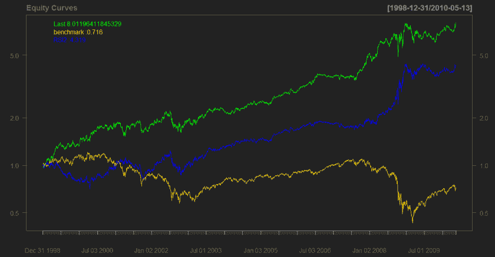
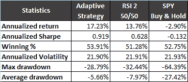

<!--yml
category: 未分类
date: 2024-05-18 14:03:48
-->

# Using Probability Density as an Adaptive Mechanism – Quantum Financier

> 来源：[https://quantumfinancier.wordpress.com/2010/05/14/using-probability-density-as-an-adaptive-mechanism/#0001-01-01](https://quantumfinancier.wordpress.com/2010/05/14/using-probability-density-as-an-adaptive-mechanism/#0001-01-01)

I will take a pause of the Time Machine series for now while I work on it some more and prepare future posts. Today I will follow up on my post on return distributions and show a simplistic way to include it in an adaptive strategy.

It has been discussed quite a lot on the blogosphere that a strategies with fixed parameters are inferior to adaptive strategies. For example the simplest daily MR strategy I can think of is probably RSI 2 50/50, but this strategy did not always worked and I certainly don’t expect it to keep working forever. Furthermore, the most profitable lookback parameter for RSI also varies in time. This is where return distribution is useful. From it, we can derive the probability density function and use that to create an adaptive mechanism.

Just a little background on probability density function; from wiki: “density of a continuous random variable is a function that describes the relative likelihood for this random variable to occur at a given point in the observation space.” In plain language; the probability of a certain event happening. I recommend using your favorite statistical software to do so, unless you want to be doing integrals for a long time!

For this test, I took SPY data, computed RSI values for different lookback periods (2 to 30), and then looked at the results for each strategy. For a rolling period of 1 year and 6 months I looked at the probability densities of returns for every strategy looking specifically at the probability of returns greater than zero (this can be changed to a higher threshold, just want to keep it basic for this). I then traded the strategy that had the highest combination of 1 year and 6 months values. That way, the capital is allocated to the strategy with the parameter generating the highest probability of positive returns as measured by the probability density function. I compared the strategy, RSI 2 50/50 and buy and hold.

Results

The results are not particularly impressive, the point of the article was to illustrate the concept as simply as possible. I believe that there is ways to make this particular strategy more robust; as a starter to take a shorter time frame for the lookback period to make it more sensitive to recent market data or introducing a weighting scheme to weight more recent data. I will let the reader experiment with it, I would be happy to post results if you care to share. Even though the results are not spectacular, the strategy seems to adapt to the different waves in the market and allocate the capital to a more appropriate parameter length for the RSI depending on the current market paradigm.

QF