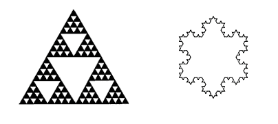
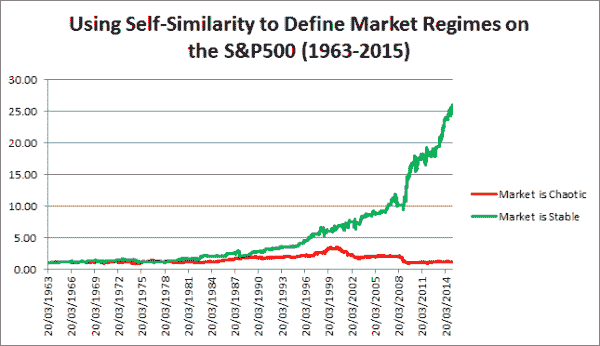
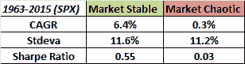

<!--yml
category: 未分类
date: 2024-05-12 17:47:47
-->

# Using a Self-Similarity Metric with Intraday Data to Define Market Regimes | CSSA

> 来源：[https://cssanalytics.wordpress.com/2015/03/13/using-a-self-similarity-metric-with-intraday-data-to-define-market-regimes/#0001-01-01](https://cssanalytics.wordpress.com/2015/03/13/using-a-self-similarity-metric-with-intraday-data-to-define-market-regimes/#0001-01-01)

The images above are the famous [Sierpinski Triangle](http://en.wikipedia.org/wiki/Sierpinski_triangle) and the [Koch Snowflake](http://en.wikipedia.org/wiki/Koch_snowflake). These objects are “self-similar” and this means that examination at finer levels of resolution will reveal the same shape. Both are examples of “fractal” geometry, and are characteristic of many phenomena in the natural world such as mountains, crystals, and gases. Self-similar objects are associated with simplicity, redundancy and hence robustness. Self-dissimilar objects are associated with complexity and chaos. Several mathematicians (including Mandelbrot) have observed that markets are clearly non-gaussian or non-normal. Markets exhibit “fat-tails” and have a distribution that shares more in common with a Levy distribution than the normal distribution which is used frequently in quantitative finance. But the market does not have a constant distribution- at times the market behavior is fairly normal in character while at other times the market is wild and unpredictable. The question is how we can effectively determine which regime the market is in so that we can apply the appropriate trading strategies to mitigate risk.

The essence of self-similarity and complexity is to compare the whole to its component parts. For example lets take a square that is divided into four separate squares of equal size. The area of the larger square is equivalent to the sum of the areas of each of its component squares. The same of course is true of a one-dimensional line which is equivalent to the sum of its parts. One of the methods of identifying self-similarity in the stock market is to look at the range or the difference between the highs and the lows. We would expect that in a perfectly self-similar market the longer range would be equivalent to the sum of the ranges measured over a smaller interval. The more chaotic the market is, the greater the difference will be between these two measures. Such market conditions would be characterized by a large ratio between the sum of smaller ranges versus the longer measure of range. Essentially this relationship is called fractal dimension and is a measure of complexity. There are many different ways to measure this including using the Hurst exponent, but the problem I have always found in my own humble research is that the suggested thresholds defined by specific absolute values do not seem to reflect the information consistent with theory. I have often found that relative measures tend to be more robust and consistent- much the same way that the magnitude of past returns has less predictive value than the relative rank of past returns. Relative measures tend to be more stationary than absolute values. To compute this measure of self-similarity I use the intraday range (high minus low) versus a longer range window. Here is how it is calculated:

1) find the high minus the low for each day going back 10 days
2) take the sum of these values (sum of the pieces)
3) find the 10-day range by taking the 10-day maximum (including the highs) and subtracting out the 10-day minimum (whole range)
4) divide the sum of the pieces by the whole range- this is a basic measure of fractal dimension/complexity
5) take the 60-day average of the 10-day series of the complexity values- this is the quarterly “chaos/stability” metric
6) use either the 252-day normsdist of the z-score or the percentile ranking of the chaos/stability metric
7) values above .5 indicate that the market is in a “chaos” regime and is much less predictable and non-stationary, values below .5 indicate that the market is stable and much more predictable.

When the market is “stable” it is easier to apply effective quantitative trading systems. When the market is in “chaos” mode, it is not necessarily volatile- but rather it is too complex to use for standard measurement and calibration of basic linear prediction. Let’s look at how this measure performs over a long time period using the S&P500 as a test set. The high and low values are generally the same until about 1963 which is when we will begin this test. Here is how the market performed in both regimes over the last 50+ years:

The market performs quite poorly in “chaos” conditions, and seems to make all of its long-term returns in the “stable” regime. Note however that the volatility is not materially different between both regimes- this means that we are capturing something different than just high and low volatility market conditions. Furthermore the correlation between the chaos indicator signals and for example the basic trend signal of a 200-day moving average is -.116\. This means that we are capturing something different than just the market trend as well. The indicator is meant to be used to define regimes rather than as a trading signal to go long or short, but clearly there are some interesting attributes worthy of further exploration and refinement.