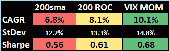
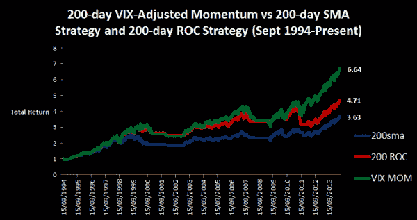

<!--yml
category: 未分类
date: 2024-05-12 17:53:02
-->

# VIX-Adjusted Momentum | CSSA

> 来源：[https://cssanalytics.wordpress.com/2014/07/29/vix-adjusted-momentum/#0001-01-01](https://cssanalytics.wordpress.com/2014/07/29/vix-adjusted-momentum/#0001-01-01)

The addition of many small details can make a big difference in seemingly simple strategies. I often like to use cooking analogies, and so I like to think of tomato sauce as a classic example: it contains few ingredients and is simple to make but difficult to master without understanding the interaction between components. Trend-following strategies are no different: anyone can create a simple strategy, few can master the nuances. One of the problems in measuring trends in financial market data is that the variance is not constant. In statistics we know that [heteroscedacity](http://en.wikipedia.org/wiki/Heteroscedasticity) can render the use of traditional regression analysis meaningless. Therefore, to use un-adjusted price data in conjunction with a moving average strategy, or even taking the simple compound return or ROC (rate of change) can lead to potentially poor timing decisions and increase the frequency of trading.

The good news is that it is well-accepted that volatility is highly predictable in financial markets. Perhaps one of the best measures of volatility is implied volatility reflected by market participants in the VIX. A simple idea would be to use the VIX to adjust daily returns in order to create a trend-following strategy that is more robust to non-constant variance. The method as follows is very simple:

1) compute daily returns or log returns for the S&P500 time series
2) divide each daily return by the VIX level on the same day
3) take a lag of your choosing and compute the simple average–say 200-days in this example

Strategy: Go LONG when the VIX-Adjusted Momentum>0, Go to cash if sma, cash if not) and a 200-day traditional momentum strategy (go long when the ROC>0, cash if not).

here is a graph comparing the strategies:

Clearly the VIX-ajusted momentum is superior to the traditional trend-following strategies using this set of parameters. This concept can be extended in several different ways- for example, one could instead use historical volatility, or the difference between historical and implied in other creative ways. Hopefully readers will be inspired to take a fresh look at improving upon a simple and traditional strategy.