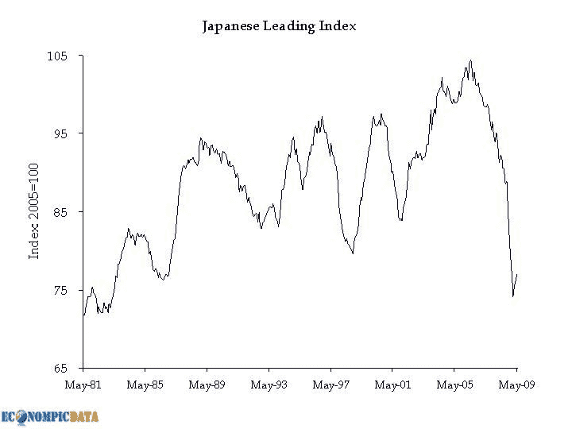

<!--yml
category: 未分类
date: 2024-05-18 17:40:02
-->

# VIX and More: “Darn Nice Economic Eye Candy”

> 来源：[http://vixandmore.blogspot.com/2009/07/darn-nice-economic-eye-candy.html#0001-01-01](http://vixandmore.blogspot.com/2009/07/darn-nice-economic-eye-candy.html#0001-01-01)

Lately it seems as if every new piece of economic data gets scrutinized ten different ways for signs of green shoots, brown shoots, bottoming, rebounding and backsliding. To make matters worse, there are headline numbers, data subsets which are ex-this and ex-that, month-over-month comparisons, year-over-year comparisons, and comparisons relative to consensus estimates – and depending on who you are listening to, there can even be multiple ‘consensus’ numbers.

Fortunately, there are a number of excellent sites in the blogosphere that are quick to distill each piece of new economic data into some essential graphics. Some of the best of these, like [Calculated Risk](http://www.calculatedriskblog.com/), [The Big Picture](http://www.ritholtz.com/blog/), etc. are widely known. Other blogs that rip apart the data and repackage the highlights graphically should probably be better know. Included among this group is [EconomPicData](http://econompicdata.blogspot.com/), which is responsible for the chart below.

Here is the lead from this morning’s Bloomberg news report that bears the headline [Bank of Japan Says Recession Easing in All 9 Regions](http://bloomberg.com/apps/news?pid=20601068&sid=ap36WVfaS47U):

> **The Bank of Japan became more optimistic about the economy in all nine regions for the first time since January 2006 and Governor Masaaki Shirakawa said exports and industrial production are recovering.**
> 
>  **“The pace of economic deterioration was slower in all regions,” the central bank said in a [quarterly report](http://www.boj.or.jp/en/type/ronbun/chiiki_rep/chiiki0907.htm) in Tokyo today.**

 **Jake at EconomPicData puts this optimism into a [broader historical context](http://econompicdata.blogspot.com/2009/07/japanese-optimism.html):

*[graphic: EconomPicData]*

There may indeed be signs of progress, but it certainly strikes me as premature to get excited about the magnitude of improvement.

For a steady stream of economic graphics and interpretation, check out the site with the tagline [Darn Nice Economic Eye Candy](http://econompicdata.blogspot.com/).**