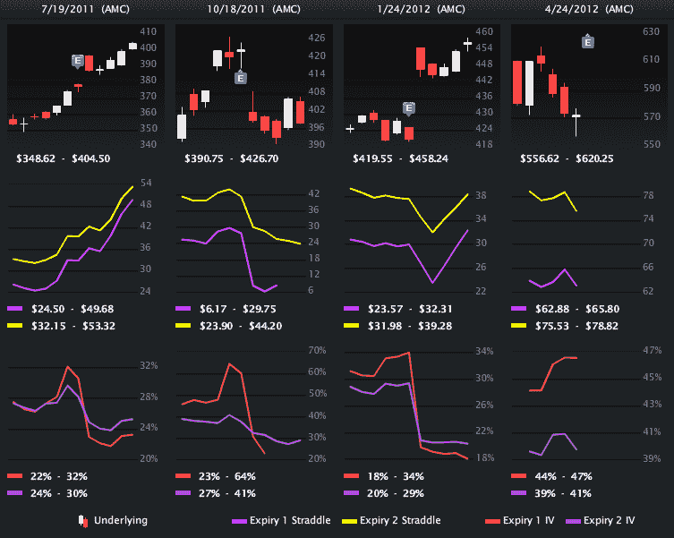
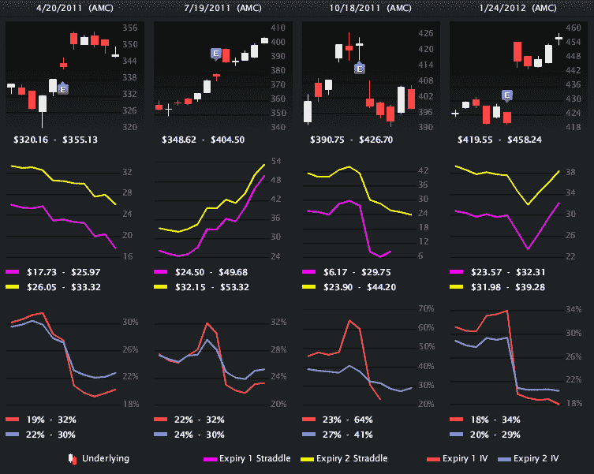
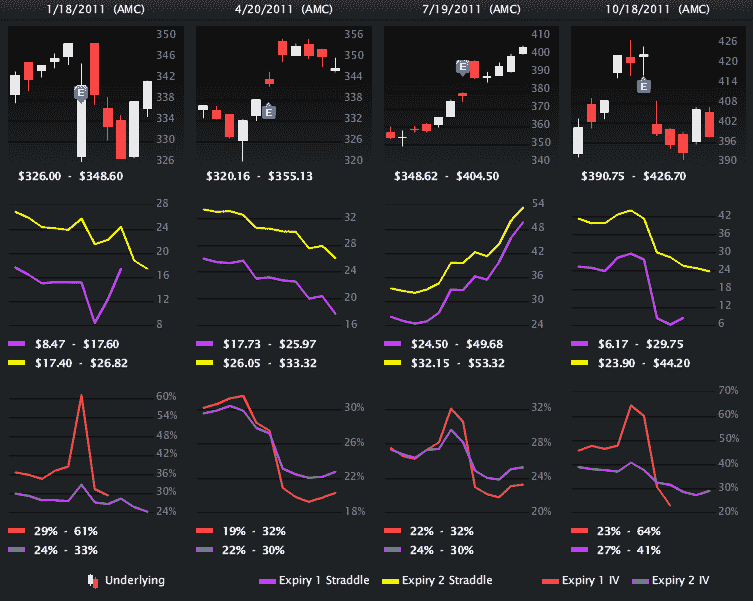
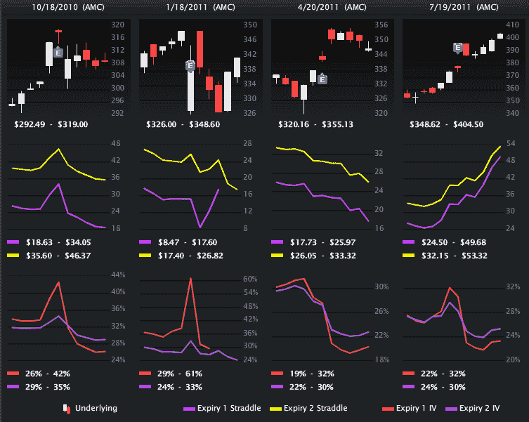
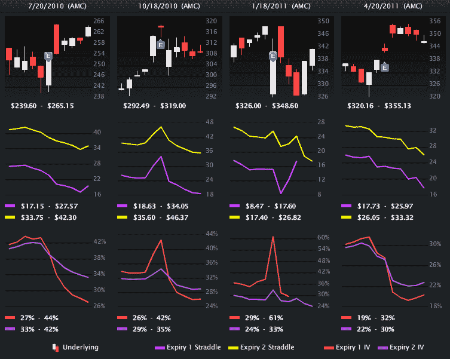

<!--yml
category: 未分类
date: 2024-05-18 16:32:04
-->

# VIX and More: A Brief History of Apple Earnings, in Pictures

> 来源：[http://vixandmore.blogspot.com/2012/04/brief-history-of-apple-earnings-in.html#0001-01-01](http://vixandmore.blogspot.com/2012/04/brief-history-of-apple-earnings-in.html#0001-01-01)

If a picture is worth a thousand words, then perhaps I can save quite a few keystrokes and maybe even a few tweets with the compendium below.

This is a visual post, so I will keep my comments brief, except to note that the graphics below originate from [LivevolPro.com](http://livevolpro.com/) and provide a graphical history of Apple ([AAPL](http://vixandmore.blogspot.com/search/label/AAPL)) earnings from July 2010 to the present.

Each column represents one earnings reporting cycle and includes three charts and four earnings periods:

1.  Top candlestick chart shows eleven days of AAPL stock prices, with five days before and after the earnings report
2.  Middle chart shows the prices of straddles in the front month and second month for AAPL options (useful for determining the degree to which investors under or overestimated the post-earnings price move)
3.  Bottom chart shows 30-day implied volatility derived from the front month and second month AAPL options (similar to what is now available from [VXAPL](http://vixandmore.blogspot.com/search/label/VXAPL))

Remember that you don’t have to have an option about Apple’s earnings report, but since everyone else does and the markets have one priced in, it may be helpful to put the current situation into historical context.

Related posts:

**

*[source(s): LivevolPro.com]*

***Disclosure(s):*** *Livevol is an advertiser on VIX and More*