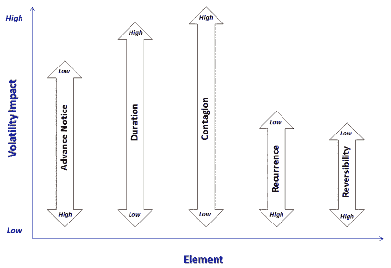

<!--yml
category: 未分类
date: 2024-05-18 18:23:09
-->

# VIX and More: A Conceptual Framework for Volatility Events

> 来源：[http://vixandmore.blogspot.com/2008/10/conceptual-framework-for-volatility.html#0001-01-01](http://vixandmore.blogspot.com/2008/10/conceptual-framework-for-volatility.html#0001-01-01)

I developed a framework to aid in thinking about volatility events awhile back and given the recent volatility, I thought it might be helpful to share that framework.

First, there are many different types of events that affect volatility. Some of these events transpire almost instantaneously according to an exact timetable that is *known in advance*, even if the facts are a surprise. Examples of exact-instantaneous volatility events include government economic data (e.g., tomorrow’s weekly [jobless claims](http://vixandmore.blogspot.com/search/label/jobless%20claims)), corporate earnings announcements (e.g., Chevron ([CVX](http://finance.yahoo.com/q?s=CVX)) reports tomorrow), and yesterday's speech by Ben Bernanke. Other events *unfold incrementally* on a fuzzy timetable, with any number of twists and turns. Examples of fuzzy-incremental events include hurricanes (Gustav, Hanna, etc.), geopolitical crises (Georgia/South Ossetia, Iran, Iraq, etc.), and of course, the current financial crisis.

*Contagion* is an important aspect of volatility events. Will the event spread and trigger other related high volatility events? Sector contagion (institutional interconnectedness in the financial sector) and geographical contagion (the Asian financial crisis) are relatively common, but entity-specific problems (e.g., Enron) generally do not spread to encompass an entire sector (though they might hint at a broader previously unrecognized sector problem.)

Without diving into too much detail in this space, I will mention two other related elements of a conceptual framework for volatility events: *recurrence* and *reversibility*. Government data reports are recurring and reversible. Productivity and [GDP](http://vixandmore.blogspot.com/search/label/GDP) numbers are released quarterly and are subsequently revised. FOMC announcements and same store sales numbers are recurring, but are not revised. Fuzzy-incremental volatility events are not recurring (in identical form) and are not reversible. Legal rulings, however, are not recurring and are reversible.

So what does this all mean? It means that most volatility events can be classified along five dimensions and those dimensions can be used to predict the magnitude of the impact that a specific event type will have on volatility.

In the graphic below, I have distilled the above into five dimensions and have provided a framework for thinking about how they impact volatility. A high volatility event would therefore generally have little advance notice (note the “Low” designation at the top of the arrow, meaning that a low level of the element translates into high volatility), have a long duration, involve a high degree of (or potential for) contagion, not be recurring, and not be reversible. Also, the contagion element normally has a greater impact on volatility than advance notice, which tends to be a more important volatility factor than reversibility, etc.

[source: VIX and More]

As always, feedback is encouraged.