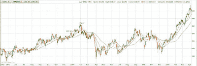
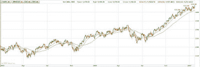

<!--yml
category: 未分类
date: 2024-05-18 16:02:07
-->

# VIX and More: A History of Sub-10 VIX Closes

> 来源：[http://vixandmore.blogspot.com/2007/01/history-of-sub-10-vix-closes.html#0001-01-01](http://vixandmore.blogspot.com/2007/01/history-of-sub-10-vix-closes.html#0001-01-01)

Today the CBOE Volatility Index closed under 10.00 for just the ninth time since it was launched in 1993.  Three questions immediately arise from this fact:

1.  What is the history of sub-10 closes?
2.  What does the current one mean?
3.  How might the current situation be tradeable?

Today we will start with the first question, touch on the second one, and push the third one off until tomorrow morning.

***The 1993-94 Lows***

Looking at the history books, prior to 2006, the VIX closed below 10.00 on five occasions: four consecutive days in late December 1993; and once in late January 1994\. In all instances, the VIX rebounded sharply higher 3, 5, 10, 20 and 50 days later. For the record, the SPX was little changed in the 3/5/10/20/50 day time from the four consecutive days in December 1993, but did sell off following the January 1994 low.

The details are as follows:

*Sub-10 VIX #1-4)* On 12/23-24/1993 and 12/27-28/1993 the VIX closed at 9.31, 9.48, 9.70 and 9.82, respectively. For comparison purposes, the SPX closed in the range of 467-471 during the same period. Three days later, the VIX was already up 6%, 10%, 10% and 19%.  By the fifth trading day, those same gains had been extended to 15%, 23%, 30% and 21% from those closes.  Ten trading days from the VIX lows, the VIX was up 21%,16%, 11% and 15%, while the SPX was anywhere between flat to up 1.0%. Twenty trading days from the lows, the VIX still showed cumulative gains of 20%, 17%, 20% and 16% from the original lows, with the SPX flat to up 1.6%. The more dramatic action came in the next 30 trading days, as 50 days from the original lows, the VIX was trading between 14.41 and 16.23, for cumulative gains of 72%, 50%, 57% and 47%. By the 50 day mark, the SPX had drifted down slightly, between -0.6% and -1.0% of the corresponding December close. The bottom line: the VIX was a good long at these lows and the SPX did not move for the next 50 trading days.  In fact, there was no substantial drop (single day or cumulative) in the SPX until February 1994 and the SPX drifted sideways until the end of March 1994.

*Sub-10 VIX #5)* About a month later, on 1/28/1994, the VIX closed at 9.94, the last time it would close that low until November 2006\. Looking at the same 3/5/10/20/50 day trading frame, the VIX rallied from that low to 10.61, 15.25, 14.46, 14.87 and 16.62, representing gains of 7%, 53%, 45%, 50% and 67% from the low. This time there was movement in the SPX, as it posted moves of +0.7%, -2.3%, -1.8%, -2.4% and -6.5% over the corresponding 3, 5, 10, 20 and 50 trading day periods.  The big move behind the SPX numbers was a -2.3% drop in the SPX on the 5th trading day following the 1/28 low. This also happens to be the 28th, 29th, 30th and 31st trading day following the four consecutive December 1993 VIX lows. For the next 65 trading days, the SPX slid steadily lower, from 469 to 460, before dropping another 21 points over the course of four trading days.

***A New Era in 2006-07?***

*Sub-10 VIX #6-7)* On 11/20-21/2006, the VIX closed below 10.00 for the first time in a dozen years.  While the 50 day ROI calculations are still two weeks away, the 3/5/10/20 day analysis shows gains of 8%, 17%, 13% and 3% for the first date and 24%, 9%, 14% and 4% for the second date.  These VIX lows occurred in the fourth month of what is now a continuing six month upward move in the SPX, which has it currently 2.7% and 2.8% above the corresponding November values.  There was a -1.4% drop in the SPX three trading days after one close and four trading days after the other close, on 11/27/06\. I would not consider this drop to be noteworthy, however, as it was fully retraced over the course of the next two trading days and indeed the SPX has moved decisively higher over the past two months.

*Sub-10 VIX #8)*

On 12/14/2006, the VIX once again closed below the psychologically significant 10.00 barrier.

In the subsequent 3/5/10/20 day period, the VIX has had relatively tepid gains of 3%, 6%, 16% and 6%.

The SPX has been drifting sideways for most of this period, but with today’s strong move now stands 1.0% above the 12/14 close.

*****Interpretation of the Current (#9) Sub-10 Close***

To say that the VIX has closed under the 10.00 mark nine times is to stretch the truth a bit, as some of these daily closes might better be considered as multiple instances of two short-term volatility lulls in late 1993 to early 1994 and late 2006 to early 2007.  Each of these two periods had a multiple days of consecutive sub-10 closes followed by an “echo low” approximately one month later.  So far, today’s sub-10 close can only be considered another echo low, until we see how the balance of the current VIX lull plays out.

This categorization has important statistical implications.

Is it two clusters of lows or nine independent data points?

Either way, the small sample size has little statistical validity, but it is harder still to draw conclusions from two data points scattered over the course of 15 years.

Still, the data reflect that for each of the previous sub-10 closes, the VIX was higher 3, 5, 10, 20 and 50 days after the sub-10 close.

For the 20 day period, the VIX has always rallied at least 10% and an average of 19% from the low.

For the 10 day period, the returns are more widely dispersed, but the average is 22%.

If we look out 50 days, the minimum return is 47% and the average return is 60%.

The important caveat is that the 50 day ROI data do not yet include reaction to the 2006-07 VIX lows.

Now that investors have become somewhat accustomed to the low VIX numbers, we’ve been hearing the “It’s different this time!” calls for the past few months – and perhaps it is.

Today is the 22nd day in a row that the VIX has set a new low for the 100 day SMA.

I’m not convinced that it is different this time, but I do think that any knee-jerk reaction to buying VIX calls is not the best way to approach the current situation.**