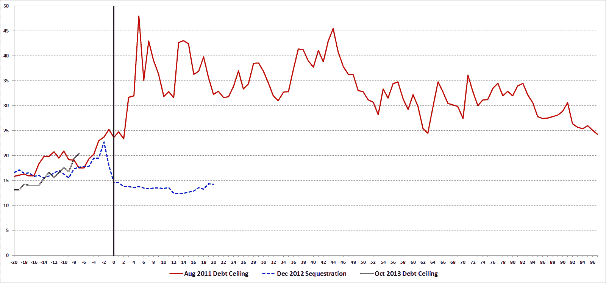

<!--yml
category: 未分类
date: 2024-05-18 16:13:03
-->

# VIX and More: A History of the VIX During Recent Debt Ceiling and Sequestration Battles

> 来源：[http://vixandmore.blogspot.com/2013/10/a-history-of-vix-during-recent-debt.html#0001-01-01](http://vixandmore.blogspot.com/2013/10/a-history-of-vix-during-recent-debt.html#0001-01-01)

Democrats and Republicans have been fighting over budgets and related matters since before any of us were born and while the debate has been heated at times, only recently has the credit of U.S. debt been called into question as a result.

During the impasse that led to the government shutdowns of November 14 – 19, 1995 and December 16, 1995 – January 6, 1996, for instance, there was nary a whiff of panic in the air, as the VIX never made it above 15 and spent a good portion of the shutdown in the 10s.

The last three instances of party budget squabbling have been much different than the Clinton-era budgetary battles and one only has to watch the trajectory of the VIX during these battles to get a sense of the uncertainty, anxiety and risk that was priced into SPX options during the period. Granted, none of these budget and debt ceiling battles has unfolded in a vacuum and the August 2011 debt ceiling battle played out against the backdrop of a dramatic worsening of the situation in [Greece](http://vixandmore.blogspot.com/search/label/Greece) and [euro zone sovereign debt](http://vixandmore.blogspot.com/search/label/European%20sovereign%20debt%20crisis) in general, but the relative moves in the VIX during these three crises can still be instructive.

The chart below captures the month leading up to as well as data following the following three budget battles, all of which had specific deadlines, which are identified in the chart by the vertical black line running through day zero:

*   the August 2011 debt ceiling crisis
*   the December 2012 sequestration crisis ([fiscal cliff](http://vixandmore.blogspot.com/search/label/fiscal%20cliff))
*   the current debt ceiling crisis

Note that the August 2011 debt ceiling crisis is a classic example of risks that turned out to be much greater than almost everyone had predicted, whereas the fears related to the December 2012 sequestration crisis quickly disappeared. Historically there have been many more false alarms than crises which have escalated out of control, which is part of the reason why investors tend to underestimate and/or discount the full potential of each threat and why the [VIX has a tendency to spike](http://vixandmore.blogspot.com/search/label/VIX%20spikes) and then [mean revert](http://vixandmore.blogspot.com/search/label/mean%20reversion) fairly quickly.

With a little over a week before the October 17 debt ceiling deadline hits, the VIX is higher now than it was at a similar stage in July 2011 or December 2012\. Certainly the political landscape has changed since the last two budget battles and both the Democrats and Republicans have had an opportunity to refine their strategies and tactics in the interim. How it all plays out this week and next is anyone’s guess. I still find it hard to believe that there will be a default, but that still leaves plenty of room for the type of “resolution” that drags out the current anxieties and leads to additional pitched battles – some of which may be even more costly – down the road.

So by all means root for a replay of December 2012, but prepare for August 2011 just in case…

*[source(s): CBOE, VIX and More]*

Related posts:

***Disclosure(s):*** *none*