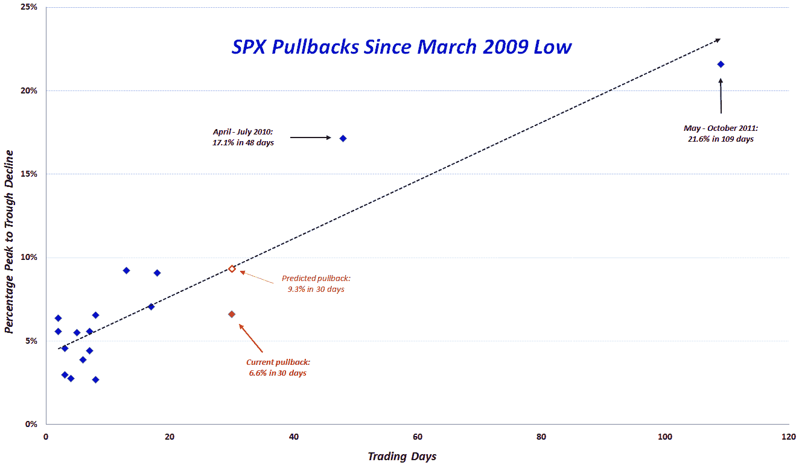

<!--yml
category: 未分类
date: 2024-05-18 16:30:22
-->

# VIX and More: A Look at the Pullbacks of the 2009-2012 Bull Market

> 来源：[http://vixandmore.blogspot.com/2012/05/look-at-pullbacks-of-2009-2012-bull.html#0001-01-01](http://vixandmore.blogspot.com/2012/05/look-at-pullbacks-of-2009-2012-bull.html#0001-01-01)

At various times over the past three years, I have been posting a table that I call the *VIX and More 2009-12 SPX Peak to Trough Pullback Summary*, the most recent version of which can be found in a March post, [Putting the Current 2.6% SPX Pullback in Recent Historical Context](http://vixandmore.blogspot.com/2012/03/putting-current-26-spx-pullback-in.html) .

This time around I thought it might be of more value to present the same data, which now includes 17 pullbacks over a the course of a 38-month period, in the form of a scatter plot, with the magnitude of the peak-to-trough drawdown on the y-axis (inverted) and the number of trading days from the peak to the trough on the x-axis.

In the graphic below, I have highlighted the current 6.6% pullback from the April 2^(nd) high of SPX 1422 with a solid red diamond. This pullback now ranks as the 6^(th) deepest in terms of peak-to-trough magnitude and 3^(rd) longest in terms of peak-to-trough trading days. Interestingly, the 6.6% pullback over the course of 30 days is well below the (dotted black) linear trend line for the full data set; the trend line prediction for 30 days is in fact a 9.3% pullback, which I have plotted with a hollow red diamond.

For reference, I have also annotated the top two pullbacks during the past 38 months:

1.  21.6% over 109 days from May to October 2011

2.  17.1% over 48 days from April to July 2010

While both of the above pullbacks had multiple causes, the theme of [Greek](http://vixandmore.blogspot.com/search/label/Greece) contagion fears was prominently featured in both pullbacks.

Whether the current pullback stops at SPX 1328 remains to be seen, but clearly it is a long way before anyone will be comfortable saying that the [European sovereign debt crisis](http://vixandmore.blogspot.com/search/label/European%20sovereign%20debt%20crisis) is contained.

Related posts:

**

*[source(s): Yahoo]*

***Disclosure(s):*** *none*