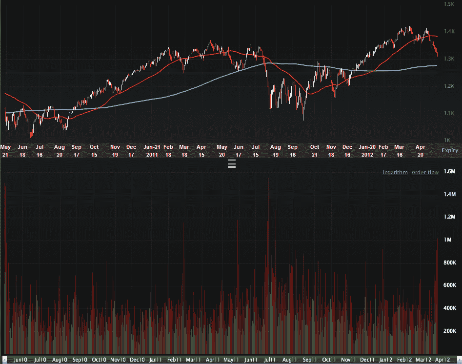

<!--yml
category: 未分类
date: 2024-05-18 16:30:00
-->

# VIX and More: A Million SPX Put Contracts Traded Today…a Contrarian Timing Signal

> 来源：[http://vixandmore.blogspot.com/2012/05/million-spx-put-contracts-traded-todaya.html#0001-01-01](http://vixandmore.blogspot.com/2012/05/million-spx-put-contracts-traded-todaya.html#0001-01-01)

With a half hour to go in today’s trading session, over one million put contracts have already been traded on the S&P 500 index, which is about 2 ½ times the average daily volume. This elevated put volume comes on top of 913,000 SPX put contracts yesterday, which was the second highest for 2012.

The one million level is rarely seen in SPX puts and generally indicates an extreme amount of hedging on the part of institutional investors, as well as increased speculative activity.

Looking at the chart below, which goes back two years, one can see that in those rare instances when put volume (vertical red bars on lower half of chart) reached one million, this typically coincided with a bottom in stocks.  *[Edit:  today’s finally tally is 1.28 million SPX puts, the highest total since August 9, 2011]*

In addition to puts in the SPX, I also closely follow the [ISEE](http://vixandmore.blogspot.com/search/label/ISEE) equities only [call to put](http://vixandmore.blogspot.com/search/label/put%20to%20call) ratio. The indicator I have developed which is based on the ISEE is now showing is greatest contrarian bullish bias (due to a preponderance of put volume) since the end of June 2010, just two days before the SPX put in an key bottom at 1010.

Of course, history is not guaranteed to repeat itself or even rhyme in the face of the current worries about [Greece](http://vixandmore.blogspot.com/search/label/Greece) and [Spain](http://vixandmore.blogspot.com/search/label/Spain), but the odds now favor stocks finding at least a short-term bottom very soon.

Related posts:

*[source(s): LivevolPro.com]*

***Disclosure(s):*** *Livevol is an advertiser on VIX and More*