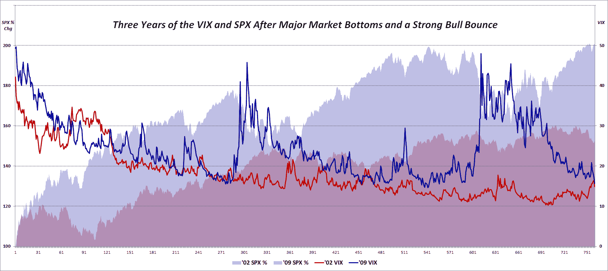

<!--yml
category: 未分类
date: 2024-05-18 16:36:05
-->

# VIX and More: A VIX of 15!?! Meet the New Reality

> 来源：[http://vixandmore.blogspot.com/2012/03/vix-of-15-meet-new-reality.html#0001-01-01](http://vixandmore.blogspot.com/2012/03/vix-of-15-meet-new-reality.html#0001-01-01)

When the VIX recently slid below 20.00 for an extended period, I sensed a noticeable unease about the state of the market in many traders and investors. Clearly a sub-20 VIX was underestimating the risks in the current and future market environment, they thought. When the VIX dipped below 18.00 that unease intensified and now with the VIX hovering around the 15.00 range and I can sense that quite a few are ready to grab the nearest pitchfork and riot about the inhumanity of the wayward VIX.

I will be the first to admit that there are a number of perplexing geopolitical, macroeconomic and other factors that pose real threats to the economy and to stocks, but I also believe that investors have become so fixated on some of the past problems that [availability bias](http://vixandmore.blogspot.com/search/label/availability%20bias) and [disaster imprinting](http://vixandmore.blogspot.com/search/label/disaster%20imprinting) has clouded their judgment to the extent that they cannot separate the current market environment from the ghosts of markets past.

With this in mind, I created a chart to show what happened the last time we had a sharp market selloff and a subsequent bounce that lasted three years. The graphic below shows the percentage change in the SPX as well as the absolute VIX level in the three years following the October 2002 lows in the SPX as well as the three years following the March 2009 lows. Note that from 2002-2005, the SPX rallied about 53%; the current rally in the SPX from the March 2009 close is over 100%.

Turning to the VIX, it starts the sequence in the 42s in 2002 and in the 49s in 2009\. Note that in both instances, the VIX had made it into the teens within one year of the beginning of the bull move. As the 2002 bull bounce continued, however, the VIX plummeted, spending a great deal of time in the 10-13 range, with a median value of 15.30 in the first three years of that bull market. The rally off of the 2009 bottom has been a different animal altogether, however, with forays down to the 15s being extremely rare (though it did happen on occasion in 2010 and 2011) and a median VIX of 22.84 during that same initial three years of the bull market.

Of course not all bull markets are the same (and there are many that will not concede that the current rally is a bone fide bull market) and every wall of worry is made of different types of stones, but at some point investors need to come to terms with the reality of a VIX of 15, particularly when we are looking at realized volatility that has been [sub-10](http://vixandmore.blogspot.com/search/label/sub-10) for the last two months.

 *Related posts:

******

***Disclosure(s):*** *none*

*[sources: CBOE, Yahoo]**