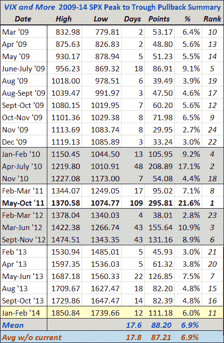

<!--yml
category: 未分类
date: 2024-05-18 16:11:11
-->

# VIX and More: A Very Middling Pullback, So Far

> 来源：[http://vixandmore.blogspot.com/2014/02/a-very-middling-pullback-so-far.html#0001-01-01](http://vixandmore.blogspot.com/2014/02/a-very-middling-pullback-so-far.html#0001-01-01)

Nary a selloff goes by these days without at least a handful of readers asking for an update of the SPX pullback table I have used to chronicle the pullbacks in the S&P 500 index since stocks bottomed in March 2009.

The table below captures the 24 most significant peak-to-trough declines from new highs during the course of what is now an almost five-year bull move:

*[source(s): Yahoo, VIX and More]*

Note that the current peak-to-trough decline of 6.0% puts the pullback in the middle (#11 of 24) of those pullbacks in terms of magnitude, though it is slightly lower than the 6.9% average (mean) pullback during the period, due to large selloffs in 2010 and 2011 that skew the average well above the median.

While the recent decline seems sharp, it actually progressed in two stages: a sideways to slightly down move for the latter half of January; and a sharper decline at the end of January and the beginning of February. If one were to plot the magnitude of the current pullback against the duration of the peak-to-trough move, it would like exactly on the trend line which can be found on the plot in [All About the Pullback from 1687](http://vixandmore.blogspot.com/2013/06/all-about-pullback-from-spx-1687.html). In other words, the current pullback, should it stop at SPX 1739, is very middling in almost all respects.

That being said, a mean pullback of 6.9% would take the SPX down to 1723 and a pullback matching the 21.6% decline from 2011 would take the SPX all the way back to 1451 – a level not seen since early January 2013.

Right now the SPX is at 1757 and has about a 1% buffer over yesterday’s low. While [emerging markets](http://vixandmore.blogspot.com/search/label/emerging%20markets) are bouncing back nicely today, anything can happen following the release of Friday’s [nonfarm payroll](http://vixandmore.blogspot.com/search/label/nonfarm%20payrolls) data.

Related posts:

***Disclosure(s):*** *none*