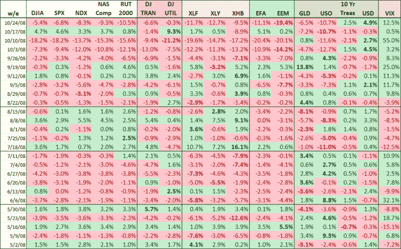

<!--yml
category: 未分类
date: 2024-05-18 18:18:31
-->

# VIX and More: A Week By Week Look at the Past Six Months

> 来源：[http://vixandmore.blogspot.com/2008/10/week-by-week-look-at-past-six-months.html#0001-01-01](http://vixandmore.blogspot.com/2008/10/week-by-week-look-at-past-six-months.html#0001-01-01)

The graphic below, which I usually reserve for the [subscriber newsletter](http://vixandmoresubscriber.blogspot.com/), shows a six month snapshot of the weekly performance of 17 indices and ETFs that I watch closely.

I am going to let this table go largely without comment, other than to note that I have bolded the largest percentage changes up and down (excluding the VIX) for each week and have grouped the weeks into four sets of 5-10 week chunks.

There are some amazing numbers in this graphic and some day when the VIX is at 14 and change, we can all look back at what was going on during this period and crack a small smile, knowing that we persevered.

[source: VIX and More]