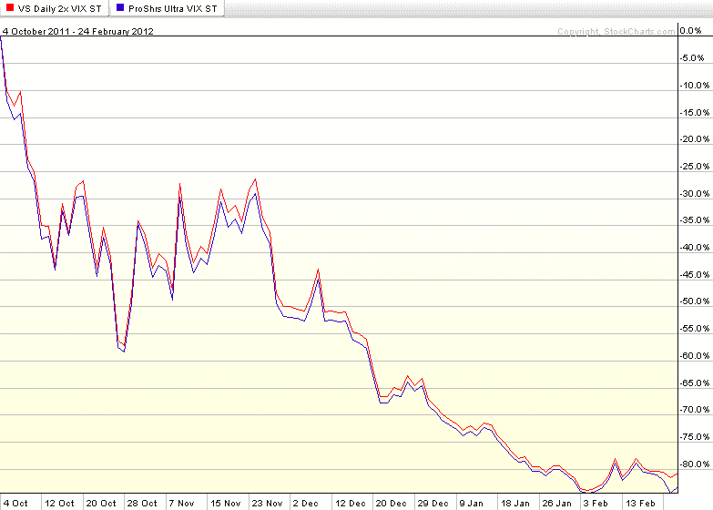

<!--yml
category: 未分类
date: 2024-05-18 16:38:15
-->

# VIX and More: All About UVXY

> 来源：[http://vixandmore.blogspot.com/2012/02/all-about-uvxy.html#0001-01-01](http://vixandmore.blogspot.com/2012/02/all-about-uvxy.html#0001-01-01)

With the media feeding frenzy surrounding the VelocityShares Daily 2x VIX Short-Term ETN ([TVIX](http://vixandmore.blogspot.com/search/label/TVIX)) during the past week, a similar product, the ProShares Ultra VIX Short-Term Futures ETF ([UVXY](http://vixandmore.blogspot.com/search/label/UVXY)), has been largely overlooked. This is unfortunate, as UVXY has a great deal to recommend it.

I talk of UVXY and TVIX as equivalent instead of equal, largely because UVXY is an ETF while TVIX is an ETN. The magnitude of this distinction is debatable, but suffice it to say that with UVXY an investor [holds](http://www.proshares.com/funds/uvxy_daily_holdings.html) VIX front month and second month [VIX futures](http://vixandmore.blogspot.com/search/label/VIX%20futures) that are used to mimic two times the moves in the S&P 500 VIX Short-Term Futures Index. With TVIX, the story is a little different, as this ETN is a debt security in which Credit Suisse ([CS](http://vixandmore.blogspot.com/search/label/CS)) essentially promises to pay investors two times the performance of the S&P 500 VIX Short-Term Futures Index. With the Credit Suisse TVIX product, therefore, there is some risk that these “senior, unsecured obligations” may not be repaid in some future scenarios.

There are other important [distinctions between ETF and ETNs](http://en.wikipedia.org/wiki/Exchange-traded_note) that I will not delve into here, but two important ones are the differences in tracking error (ETFs should not have any tracking error) and tax treatment, which is often a murky subject that is open to interpretation. I should know: I married a CPA/tax attorney and in spite of that fact, my knowledge about tax matters is only incrementally greater than when I was a single man…

The graphic below captures the performance of UVXY and TVIX since UVXY’s launch on October 4, 2011\. Now it may just be a coincidence, but TVIX made a 52-week high of 109.17 on the very same day that UVXY was launched. As the graphic below shows, in the intervening 4 months and 3 weeks, *both UVXY and TVIX have fallen in excess of 80%*. For the most part, these two securities have tracked each other step for step across a variety of market conditions. That relationship was disrupted on Tuesday when Credit Suisse suspended creation units in TVIX. During the last three trading sessions, UVXY has continued to fall -11.6%, while the supply-demand imbalance has limited losses in TVIX to just 2.1%.

With TVIX trading essentially as a [closed-end fund](http://vixandmore.blogspot.com/search/label/closed-end%20funds), its price will be much more difficult to predict going forward, which should make UVXY more attractive to investors. Clearly UVXY is already gaining fans in this new market environment, where it set new volume records on Thursday and Friday, with over 5 million shares changing hands on both days. Just two weeks ago UVXY’s volume was about 5% of what TVIX was trading. As of Friday, that number has jumped up to 38%.

With UVXY’s price now down in the 5s, I would expect to see a reverse split soon, perhaps even a 1-10 reverse split.

From the UVXY [prospectus](http://www.proshares.com/media/documents/ProSharesCommodityCurrencyProspectus.pdf):

> *“If the Sponsor believes that the per Share price of a Fund in the secondary market has fallen outside a desirable trading price range, the Sponsor may direct the Trust to declare a split or reverse split in the number of Shares outstanding and, if necessary in the Sponsor’s opinion, to make a corresponding change in the number of Shares of a Fund constituting a Creation Unit.”*

ProShares is no stranger to reverse splits for their ETFs. In [April 2010](http://www.proshares.com/resources/news/proshares_announces_reverse_share_splits_of_nine_etfs.html), ProShares initiated reverse splits in nine ETFs, with the majority of those being 1-5 splits, but UYG and ZSL subjected to a 1-10 reverse split.

During the last week, the media have focused most of their attention on TVIX and the suspension of creation units. For traders and investors, however, their attention appears to be pivoting in the direction of UVXY. The rising popularity of UVXY could have some interesting consequences, not the least of which might be a more favorable environment for Credit Suisse to consider re-opening the creation unit window.

Related posts:

**

*[source(s): StockCharts.com]*

***Disclosure(s):*** *short TVIX and UVXY at time of writing*