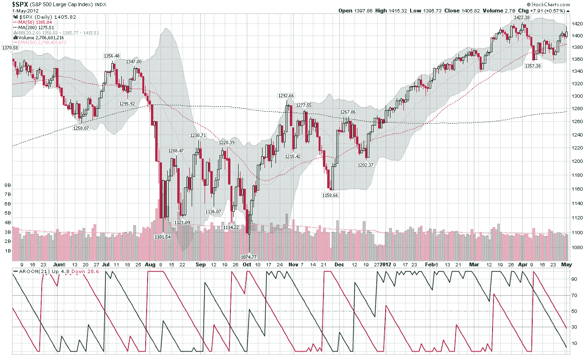

<!--yml
category: 未分类
date: 2024-05-18 16:31:18
-->

# VIX and More: An Aroon Stalemate for S&P 500 Index

> 来源：[http://vixandmore.blogspot.com/2012/05/aroon-stalemate-for-s-500-index.html#0001-01-01](http://vixandmore.blogspot.com/2012/05/aroon-stalemate-for-s-500-index.html#0001-01-01)

While the bias in stocks for the past three years and two months has definitely been upward, the S&P 500 index (SPX) has struggled to remain above 1400 ever since making a post-2008 high of 1422 on April 2^(nd).

There are many ways to determine the strength of a trend and one that has a very strong following is the Average Directional Indicator ([ADX](http://vixandmore.blogspot.com/search/label/ADX)), which was developed by Welles Wilder and first published in 1978 classic, [New Concepts in Technical Trading Systems](http://www.amazon.com/New-Concepts-Technical-Trading-Systems/dp/0894590278http:/store.stockcharts.com/products/new-concepts-in-technical-trading-systems).

While the ADX has a great deal to recommend it, I am somewhat partial to another trend evaluation tool, the [Aroon](http://vixandmore.blogspot.com/search/label/Aroon) indicator, which was developed by Tushar Chande. The Aroon is actually two measures in one, an Aroon Up (green line in study below main chart) and an Aroon Down (red line). Essentially, the Aroon Up and Down lines measure the proximity of N-period highs and lows to the most recent trading period, on a 0-100 scale, with 100 indicating that the high or low for the period was made during the most recent trading day and 0 indicating that the high or low was made on the first day of the N-period window.

The default time frame for the Aroon indicator is usually represented as 25 periods, but in some charting software, the default is 14 periods. Since I tend to look at the investing world in months that average 21 trading days, the chart below uses my favored default Aroon setting of 21 days.

The chart shows the SPX over the course of the past year, with a strong uptrend (green line above 50 or 70) since the second week in December that has recently begun to show signs of fatigue on the part of the bulls as it has now been 20 days since that high of 1422\. On the other hand, the red line shows that it has now been 15 days since the SPX made its 21-period low of 1357\. In other words, the last three weeks have seen neither the high or the low of the 21-day lookback period, as the SPX has meandered in a 65-point range. The result is that both the green line and red line have dipped below 30, signaling the absence of any meaningful bullish or bearish momentum.

The Aroon indicator is effective as a trend-following tool partly because it usually waits for 1/3 to 1/2 of the lookback window to elapse before signaling a change in trend – which is generally represented by either the green or red line crossing the horizontal lines at 50 or 70.

As it looks now, if stocks were to continue to tread water for the next four days, Monday would likely signal an ascendant green line, but Friday’s employment report, the European Central Bank and other factors make it unlikely that stocks continue to trade in a narrow range for another week or so.

 *Related posts:

**

*[source(s): StockCharts.com]*

***Disclosure(s):*** *none**