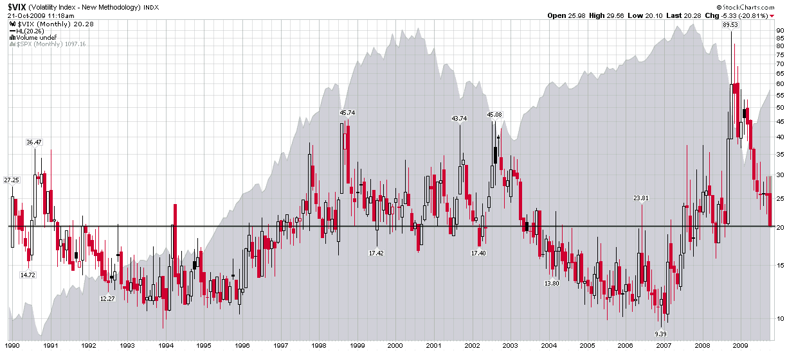

<!--yml
category: 未分类
date: 2024-05-18 17:25:43
-->

# VIX and More: Anchoring and a VIX of 20

> 来源：[http://vixandmore.blogspot.com/2009/10/anchoring-and-vix-of-20.html#0001-01-01](http://vixandmore.blogspot.com/2009/10/anchoring-and-vix-of-20.html#0001-01-01)

I can’t quite decide whether to be delighted or puzzled that so many people seem to care that the CBOE Volatility Index (VIX) is approaching 20\. In truth, I feel a little bit of each. When I started this blog, I decided to devote a fair amount of attention to this unusual statistic that very few people were aware of and most that did had stopped paying attention to out of boredom. Of course the VIX was at about 10 then, the markets were awash in liquidity, and following a volatility index felt about as useful as trying to estimate Usain Bolt’s times with a sundial.

Fast forward three years and many things have changed. I can certainly appreciate the role the VIX played in trying to help the masses quantify fear in the midst of the financial crisis. When the VIX hit 50, 60, 70 and 80, these new highs sent a message that the situation was getting worse – or that investors were willing to pay dearly to protect themselves from the many potential disaster scenarios looming on the horizon.

A funny thing happened when the markets started to recover. We started to hear a variety of opinions that the VIX was too low, that substantial risks still remained, etc. The “VIX is too low” argument has been heard for several months now, but it seems to be gathering steam as the VIX approaches 20.

More than 35 years ago, [Amos Tversky](http://en.wikipedia.org/wiki/Amos_Tversky) and [Daniel Kahneman](http://en.wikipedia.org/wiki/Daniel_Kahneman) wrote a seminal piece on [anchoring](http://en.wikipedia.org/wiki/Anchoring_and_adjustment) called [Judgment Under Uncertainty: Heuristics and Biases](http://www.hss.caltech.edu/~camerer/Ec101/JudgementUncertainty.pdf). In the words of the authors:

 **> “In many situations, people make estimates by starting from an initial value that is adjusted to yield the final answer. The initial value, or starting point, may be suggested by the formulation of the problem, or it may be the result of a partial computation. In either case, adjustments are typically insufficient. That is, different starting points yield different estimates, which are biased toward the initial values. We call this phenomenon anchoring.”* 

This is the same line of thinking practiced by investors who watch [GOOG](http://vixandmore.blogspot.com/search/label/GOOG) hover around the 450 mark for week after week, thinking they will wait until the stock falls to 400 to buy it on the cheap. The problem is that when GOOG moves over 500, all that anchoring around the 450 has conditioned the brain to think that 500 is too expensive, no matter how much GOOG rallies from that level.

Turning to the VIX, not only have all those readings in the 30s, 40s and 50s been recently imprinted into the investor’s psyche, but so also has all the emotional turmoil associated with the financial crisis and stock market crash. Even if things are better, the argument goes, can they possibly be *this* much better so *soon* after the global financial system was teetering on the edge of a cliff? The short answer is that anchoring makes it difficult for many investors to adapt to new price ranges and a new set of circumstances as situations change. It is part of the reason why bulls cling to hope on the way down and perma-bears have difficulty changing their bias when the market bounces. Finally, it is why so many people seem to be incredulous that the VIX is almost down to 20.00 when the lifetime (20 year) moving average for the volatility index is 20.26\. In terms of volatility, we are right at the VIX’s lifetime moving average, which means investors are pricing in an average amount of risk and uncertainty – in historical terms – at the moment.

Of course, if one were to be anchored in the last 12 months, the VIX would be at an all-time low. Conversely, if one were anchored in the period from 2004-2006, the VIX would be in the 99^(th) percentile, almost at an all-time high.

So…pull up the anchor and set your sails for the new volatility environment.

*[source: StockCharts]**