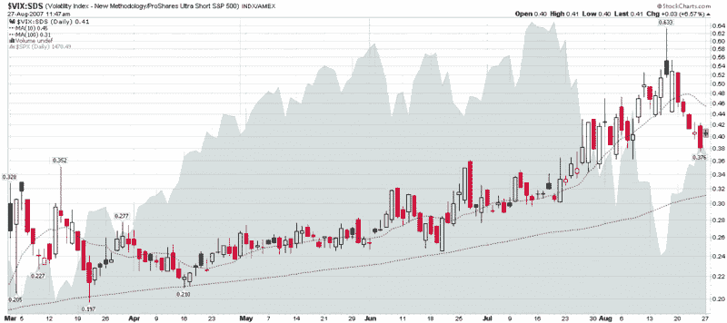

<!--yml
category: 未分类
date: 2024-05-18 19:01:17
-->

# VIX and More: Another Look at the VIX:SDS Ratio

> 来源：[http://vixandmore.blogspot.com/2007/08/another-look-at-vixsds-ratio.html#0001-01-01](http://vixandmore.blogspot.com/2007/08/another-look-at-vixsds-ratio.html#0001-01-01)

Back on August 10^(th), when the markets were testing the first set of lows, I toyed with several indicators that I thought might help me better separate fear from volatility.  I published a [10-day chart](http://vixandmore.blogspot.com/2007/08/fear-vs-volatility.html) of one of those, the VIX:SDS ratio.

I have been keeping an eye on this ratio during the past 2 ½ weeks and noticed that the extreme reading of .633 it did an excellent job of flagging the recent market bottom.  I am still not sure how useful the VIX:SDS ratio may be going forward, but I thought a six month chart might be interesting analytical fodder for those who like to contemplate such matters.  As always, comments are welcome.

As a quick reminder, SDS is an ETF that is intended to track at 2x the inverse of the SPX.  More information is available from [ProShares](http://www.proshares.com/funds/sds).

