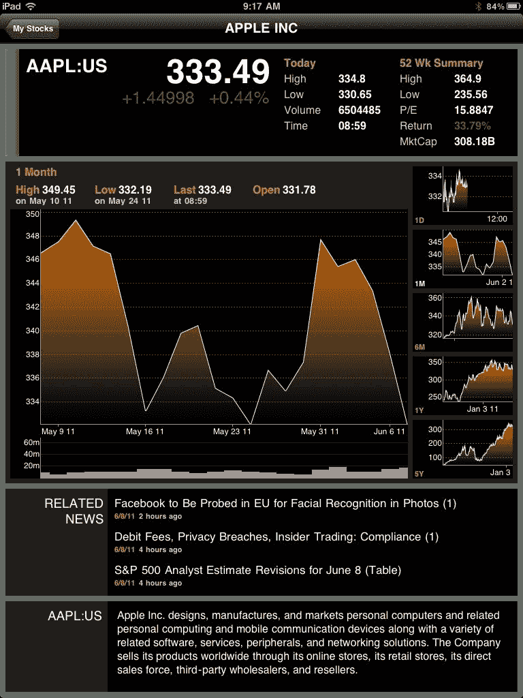

<!--yml
category: 未分类
date: 2024-05-18 16:49:44
-->

# VIX and More: Apple Products vs. Platform

> 来源：[http://vixandmore.blogspot.com/2011/06/apple-products-vs-platform.html#0001-01-01](http://vixandmore.blogspot.com/2011/06/apple-products-vs-platform.html#0001-01-01)

Apple ([AAPL](http://vixandmore.blogspot.com/search/label/AAPL)) is an unusual stock for several reasons, not the least of which is the strong retail demand for the stock and a large contingent of customer-zealots who regularly worship at the altar of Steve Jobs.

Throw together the factors mentioned above, Apple’s history of important product announcements at major events and the return of Jobs and his unique talent for unveiling new cutting edge products and you get an interesting confluence of events – and expectations – at Monday’s Apple Worldwide Developers Conference.

These conferences are always abuzz with [rumors and speculation](http://news.cnet.com/8301-27076_3-20069519-248/apple-wwdc-rumor-scorecard-2011-edition/) about the next big thing that Apple is going to announce which will once again change the technology landscape. When is the next [iPad](http://vixandmore.blogspot.com/search/label/iPad) coming? What new features will it include? When will the [iPhone](http://vixandmore.blogspot.com/search/label/iPhone) 5 be out? What will the next iOS and Mac OS operating systems do? What will be the implications for the devices they run? What is the iCloud and what does it mean?

In the end, those hoping for groundbreaking new products were disappointed. The iPad, iPhone, iPod, MacBook, iMac, Mac Pro, AppleTV, etc. were not on stage. Instead, the hardware devotees had to settle for innovations which were confined to operating systems enhancements and the iCloud – stuff you can’t wait in line for at an Apple store, take home and dazzle your friends and family with.

The irony is that the obsession with hardware misses the big point. New products are critical to Apple’s business, but at best it gets them a first mover advantage that is not guaranteed to endure. The truth is that from a strategic perspective the iCloud is much more important to Apple’s future than any new product, because the iCloud is a platform play that enhances the value of the full range of Apple products and services, including future products and services.

Let me illustrate this with a personal example. I have about a quarter of a century of PC-based computer experience. I probably owned two dozen laptops before I bought my first Apple product, an iPhone. When the iPad 2 came out, however, it was easy for me to expand my stable of Apple products. Now that I am habituated to iTunes and the App Store, it is easier for me to contemplate something like the MacBook. With all of these devices seamlessly sharing data in the background on the iCloud, the data argument for expanding my suite of Apple products becomes that much more compelling. It is a similar story for my wife, who only recently began playing with her first Apple product, the iPad. She has been so completely won over that an iPod will soon follow and then I’m betting an iPhone will be too difficult to ignore. By the time she gets around to replacing her laptop, I’m fairly sure the MacBook Air will win her over – even if she doesn’t even know what it is right now.

I suspect that something similar is in the process of happening across the globe. Many of us who have spent the majority of our careers in a PC-centric corporate environment have often found Apple products to be too much of a compatibility issue to be worth the trouble. They have been relegated to toy status rather than serving as our our central computing devices. The iCloud gives Apple a chance to convert those PC cling-ons not only to exciting Apple products and services, but to a iCloud data world that could be a platform revolution. Device-independent data sharing is just around the corner and Microsoft ([MSFT](http://vixandmore.blogspot.com/search/label/MSFT)), Google ([GOOG](http://vixandmore.blogspot.com/search/label/GOOG)) and their ilk better have a strong alternative – and soon.

As for AAPL stock, it is down about 3% since Steve Jobs took the stage on Monday. Savvy investors should be thinking more about Brian Arthur’s [Increasing Returns and the New World of Business](http://www.santafe.edu/media/workingpapers/96-05-028.pdf) and less about the timing of new product announcements.

*[graphic: Bloomberg for iPad]*

 ****Disclosure(s):** long AAPL at time of writing**