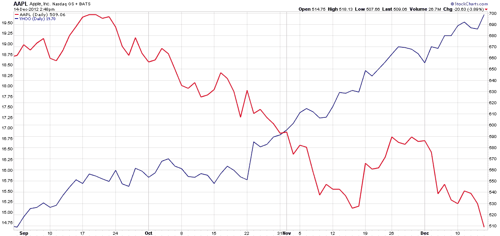

<!--yml
category: 未分类
date: 2024-05-18 16:21:14
-->

# VIX and More: Apple and Yahoo! Moving in Opposite Directions (Again)

> 来源：[http://vixandmore.blogspot.com/2012/12/apple-and-yahoo-moving-in-opposite.html#0001-01-01](http://vixandmore.blogspot.com/2012/12/apple-and-yahoo-moving-in-opposite.html#0001-01-01)

Over the years it has not been difficult to find charts in which Apple ([AAPL](http://vixandmore.blogspot.com/search/label/AAPL)) and Yahoo! ([YHOO](http://vixandmore.blogspot.com/search/label/YHOO)) have been moving in opposite directions. In fact, just make a chart of any random time frame and it’s a good bet that AAPL will be rising and YHOO will be falling.

For the last three months, however, that relationship has been reversed and it has been YHOO stock that has been on the rise, while AAPL’s fortunes have been on the wane, as the chart below reflects.

*[source(s): StockCharts.com]*

Part of the resurgence in YHOO is no doubt due to Marissa Mayer, the new CEO, who has already begun to put her stamp on the company and has given analysts and customers something to talk about. In fact, I searched the blog and it turns out that the company has not warranted a reference here since 2008, seemingly ready to go the way of [AltaVista](http://en.wikipedia.org/wiki/AltaVista).

[Pairs trades](http://vixandmore.blogspot.com/search/label/pairs%20trading) in the technology sector can be a rocky ride, but for those who are willing to be long YHOO and short AAPL, the potential for a big winner continues through today’s trading.

Related posts:

***Disclosure(s):*** *long YHOO and short AAPL at time of writing*