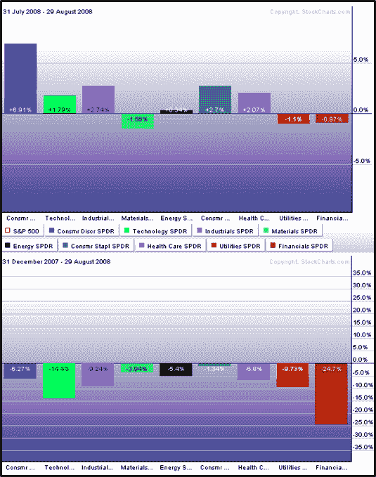

<!--yml
category: 未分类
date: 2024-05-18 18:28:29
-->

# VIX and More: August Sector Recap

> 来源：[http://vixandmore.blogspot.com/2008/09/august-sector-recap.html#0001-01-01](http://vixandmore.blogspot.com/2008/09/august-sector-recap.html#0001-01-01)

August was a month in which the S&P 500 largely drifted sideways, but there was a good deal going on in the various sectors that make up the index.  The graphic below shows sector performance for the nine sector [SPDRs](http://vixandmore.blogspot.com/search/label/SPDRs) for the first eight months of 2008 (bottom) and for the month August (top).

On the plus side, the turnaround in the consumer discretionary sector ([XLY](http://vixandmore.blogspot.com/search/label/XLY)) is clearly responsible for much of the recent positive momentum in the SPX.  Also worth noting is that four other sectors outperformed the index in August:  consumer staples ([XLP](http://vixandmore.blogspot.com/search/label/XLP)), health care ([XLV](http://vixandmore.blogspot.com/search/label/XLV)), industrials ([XLI](http://vixandmore.blogspot.com/search/label/XLI)), and technology ([XLK](http://vixandmore.blogspot.com/search/label/XLK)).

As has often been the case during the past few months, when the SPX has been moving up, energy ([XLE](http://vixandmore.blogspot.com/search/label/XLE)) and materials ([XLB](http://vixandmore.blogspot.com/search/label/XLB)) have been moving in the opposite direction. In August, the financial sector ([XLF](http://finance.google.com/finance?q=xlf)) was also pulling the index in the wrong direction.

Watch the consumer for more clues about sector leadership and overall market strength in the month of September.

[source: StockCharts]