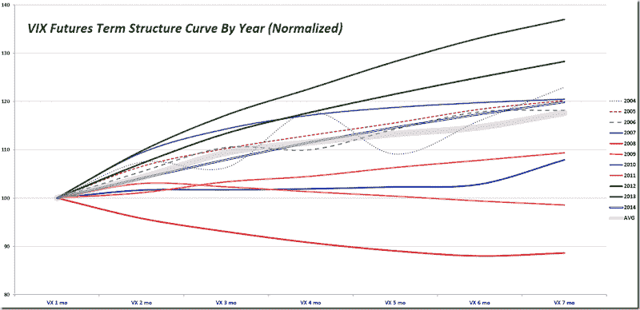

<!--yml
category: 未分类
date: 2024-05-18 16:09:31
-->

# VIX and More: Average Annual Normalized VIX Futures Term Structure, 2004-2014

> 来源：[http://vixandmore.blogspot.com/2015/01/average-annual-normalized-vix-futures.html#0001-01-01](http://vixandmore.blogspot.com/2015/01/average-annual-normalized-vix-futures.html#0001-01-01)

One graphic I post periodically that never fails to generate a great deal of interest among traders, strategists and other volatility aficionados is my normalized [VIX futures](http://vixandmore.blogspot.com/search/label/VIX%20futures) [term structure](http://vixandmore.blogspot.com/search/label/term%20structure) graph. From 2008 – 2013, the annual normalized term structure was notable in that almost every year was an outlier in one way or another. For instance, 2012 and 2013 were the two years with the steepest [contango](http://vixandmore.blogspot.com/search/label/contango) in history, while 2008, 2009 and 2011 represent three of the four years (2007 being the fourth) with the flattest term structure.

And 2014? It could not have been more average. If one combines all the years from 2004 to 2014 and creates an “average year” (i.e., the wide gray line on the chart) then 2014 (double blue line) comes closest to that average.

*[source(s): CBOE, VIX and More]*

Note that the terms structure lines are dotted and somewhat wavy for 2004 – 2006, due to the fact that the CBOE did not implement a full complement of consecutive monthly futures until October 2006.

As for 2015, which is not plotted on the graph above, so far it looks quite flat, almost like a cross between 2007 and 2009\. It will be interesting to see if this pattern holds for the balance of the year.

Related posts:

***Disclosure(s):*** *the CBOE is an advertiser on VIX and More*