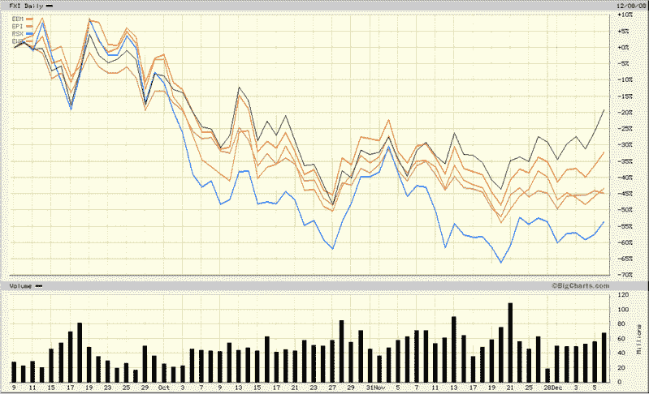

<!--yml
category: 未分类
date: 2024-05-18 18:11:51
-->

# VIX and More: BRIC Update: China a Leader or Outlier?

> 来源：[http://vixandmore.blogspot.com/2008/12/bric-update-china-leader-or-outlier.html#0001-01-01](http://vixandmore.blogspot.com/2008/12/bric-update-china-leader-or-outlier.html#0001-01-01)

I have commented on resurgent Chinese stocks several times in the past few weeks, most recently in [China About to Break Out?](http://vixandmore.blogspot.com/2008/12/china-about-to-break-out.html) Now that Chinese stocks ([FXI](http://vixandmore.blogspot.com/search/label/FXI), black line) appear to be on the rebound, an important question is whether this is an isolated phenomenon or one that will also affect other [emerging markets](http://vixandmore.blogspot.com/search/label/emerging%20markets) economies.

As the chart below shows, the rally in Chinese stocks has significantly outdistanced the recent bounce in emerging market stocks ([EEM](http://vixandmore.blogspot.com/search/label/EEM), orange line). It is the other three members of the [BRIC](http://vixandmore.blogspot.com/search/label/BRIC) group, however, that are lagging China and the broad emerging markets group the most. Not surprisingly, commodity-rich Russia ([RSX](http://vixandmore.blogspot.com/search/label/RSX), blue line) is the biggest laggard among the BRIC countries, while India ([EPI](http://vixandmore.blogspot.com/search/label/EPI)) and Brazil ([EWZ](http://vixandmore.blogspot.com/search/label/EWZ)) are trailing the broader emerging markets index, but performing better than Russia.

The question of whether growing domestic demand and a massive government stimulus package will result in a China-specific rebound or help pull other global economies along for the ride is not likely to be answered soon. In the meantime, China looks strong on a relative basis and other emerging economies should be watched closely for clues about the geographical breadth of the rally.

*[source: BigCharts]*