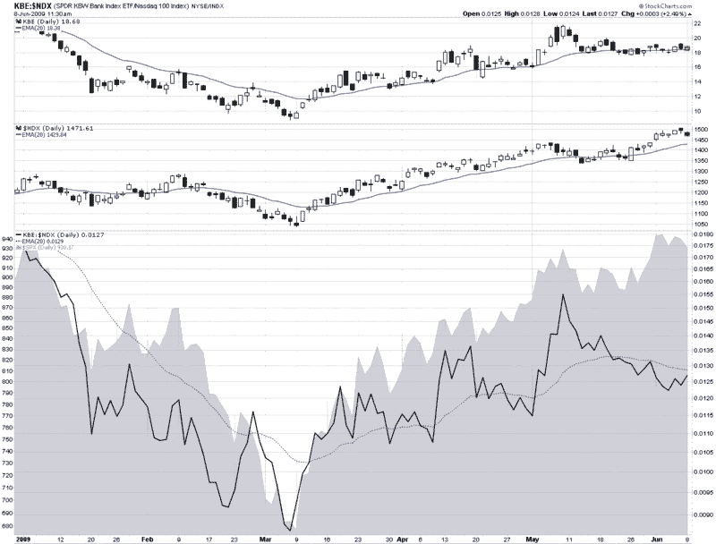

<!--yml
category: 未分类
date: 2024-05-18 17:44:03
-->

# VIX and More: Banks, Large Cap Tech and Leadership

> 来源：[http://vixandmore.blogspot.com/2009/06/banks-large-cap-tech-and-leadership.html#0001-01-01](http://vixandmore.blogspot.com/2009/06/banks-large-cap-tech-and-leadership.html#0001-01-01)

One month ago today in [The Banks vs. Technology](http://vixandmore.blogspot.com/2009/05/banks-vs-technology.html), I mentioned the divergence between technology and financials and noted, “so far the financials ([XLF](http://vixandmore.blogspot.com/search/label/XLF)) have done a better job of leading the market up than technology stocks ([XLK](http://vixandmore.blogspot.com/search/label/XLK)) have done of inspiring the bears.”

Fast forward one month and the divergence has turned upside down. In the chart below, I focus on financials in the form of the [KBE](http://vixandmore.blogspot.com/search/label/KBE) banking ETF and large cap technology as exemplified by the NASDAQ-100 or [NDX](http://vixandmore.blogspot.com/search/label/NDX).

As it turns out, May 8^(th), the day of the original post, was the top in the banking ETF. Since that date, banks have slowly trended lower (top graphic), even while large cap technology (middle graphic) and the S&P 500 index (gray area chart at bottom) have been making new highs. The change in leadership is perhaps best illustrated by the solid black line in the bottom portion of the chart, which tracks a ratio of KBE to the NDX. In March, April and the early part of May, the ratio quite accurately mirrored the movement in the SPX.

During the course of the past four weeks, however, leadership flipped from banks to large cap technology and the ratio began to decline – all while the SPX continued to make new highs.

I find it particularly interesting that it is not just the relative performance of banks that has declined, but it is also becoming increasingly common for banks and technology to move in different directions on the same day. This has been the case today and has been true for five of the past six days.

I am not surprised to see leadership being passed from financials to large cap technology, but as I said a month ago, I do not expect the market to make any significant additional gains unless the two sectors are able to move up in unison.

*[source: StockCharts]*