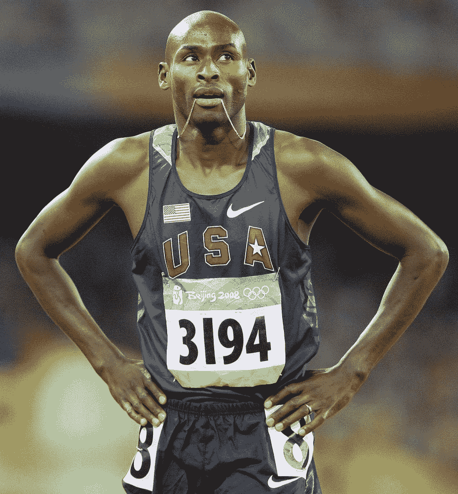
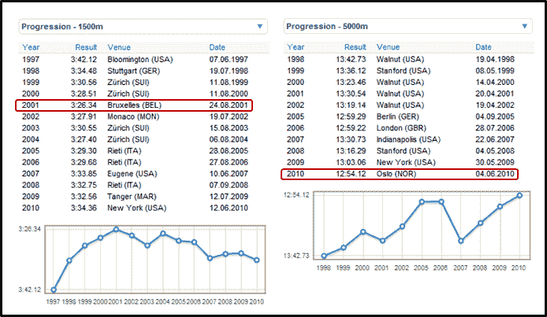

<!--yml
category: 未分类
date: 2024-05-18 17:08:04
-->

# VIX and More: Bernard Lagat and Trading Strategy

> 来源：[http://vixandmore.blogspot.com/2010/06/bernard-lagat-and-trading-strategy.html#0001-01-01](http://vixandmore.blogspot.com/2010/06/bernard-lagat-and-trading-strategy.html#0001-01-01)

Over the weekend I had an opportunity to watch on television as [Bernard Lagat](http://en.wikipedia.org/wiki/Bernard_Lagat) ran the 1500 meters in the adidas Grand Prix track and field meet in New York. Just one week after establishing a new American record at the 5000 meters distance in Oslo, Lagat ran a tactically strong race, but was outkicked at the end and finished in fifth place.

A world champion at both the 1500 and 5000 meter distances in 2007, Lagat’s 35-year-old body is now probably better suited to longer distances than 1500 meters, where he was once the second fastest man in history. The graphic below show’s Lagat’s progression over the course of the past dozen years or so. Note that Lagat peaked in 2001 in the 1500 meter distance and his times have gradually slowed since then. On the other hand, while Lagat's speed may be on the decline, his endurance is improving, with the proof that he is now 36 seconds faster in the 5000 meters than he was in 2001.

After watching the race, it occurred to me that something similar has happened to my trading – and at least anecdotally to a large number of other traders. Back in 2001, the majority of my trades were day trades, but as my opponents have become younger, faster and more technologically sophisticated, I find myself, like Lagat, refocusing my efforts on longer [time horizons](http://vixandmore.blogspot.com/search/label/time%20horizon), where my skills and experience match up better than they do against the high-frequency trading crowd.

Whereas [Carlos Lopes](http://en.wikipedia.org/wiki/Carlos_Lopes) won the Olympic marathon at the age of 37, I can almost guarantee that [Usain Bolt](http://en.wikipedia.org/wiki/Usain_bolt) will not win the 100 meters at the 2024 Olympics. Similarly, it makes little sense for me to return to day trading when my skills are a better match for the longer distance events.

As traders, we each need to know our optimal time horizons. Of course, it is important to continue to experiment with strategies across a broad range of time frames, but ultimately we need to be specialists in a specific time frame that best suits our skills and personality, yet preparing for the possibility that our optimal time horizon may be a moving target as we accumulate new knowledge and expertise.

*[As an aside, I intend to stray more frequently into the realm of metaphor and analogy in the future* *in order* *to provide a broader context in which to discuss trading in general and volatility in particular. With this in mind, I have decided to tag these posts (as well as today’s post and some previous efforts) with the label of “[farther afield](http://vixandmore.blogspot.com/search/label/farther%20afield).” Let the journey begin.]*

For more on related subjects, readers are encouraged to check out:

 *[source: DiamondLeague.com]*

***Disclosure(s):*** *none*