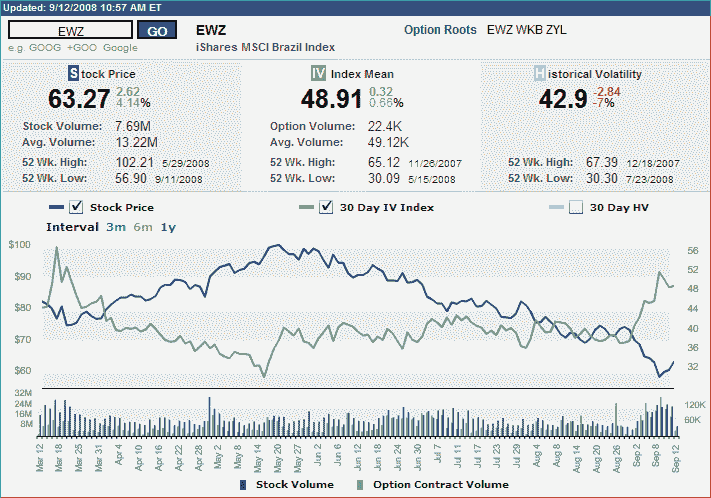

<!--yml
category: 未分类
date: 2024-05-18 18:27:04
-->

# VIX and More: Brazil Finding a Bottom?

> 来源：[http://vixandmore.blogspot.com/2008/09/brazil-finding-bottom.html#0001-01-01](http://vixandmore.blogspot.com/2008/09/brazil-finding-bottom.html#0001-01-01)

As I noted yesterday in [The U.S. VIX vs. a BRIC VIX](http://vixandmore.blogspot.com/2008/09/us-vix-vs-bric-vix.html), [emerging markets](http://vixandmore.blogspot.com/search/label/emerging%20markets) have been struggling mightily in the past few months.

An excellent example of the weakness in emerging markets can be found in [Brazil](http://vixandmore.blogspot.com/search/label/Brazil), where the Brazil country ETF ([EWZ](http://vixandmore.blogspot.com/search/label/EWZ)) fell 44.3% from a late May high to a low that was made yesterday. Now picking bottoms is a game best suited for those who are long on hubris and short on common sense, but there are several factors which lead me to believe that yesterday’s low may turn out to be an intermediate or long-term bottom.

From a purely technical perspective, the chart below shows Tuesday as the lowest close (omitted is the intra-day 52 week low from yesterday). Also on Tuesday, EWZ’s options volume hit a new high for 2008 and implied volatility spiked to levels not seen since the March panic. Of course, none of these factors guarantees a bottom, but taken together, and given the relative strength of EWZ once again today (up over 4% as I type this), they increase the likelihood of a profitable entry.

[source: International Securities Exchange]

[Disclosure: long EWZ at time of writing]