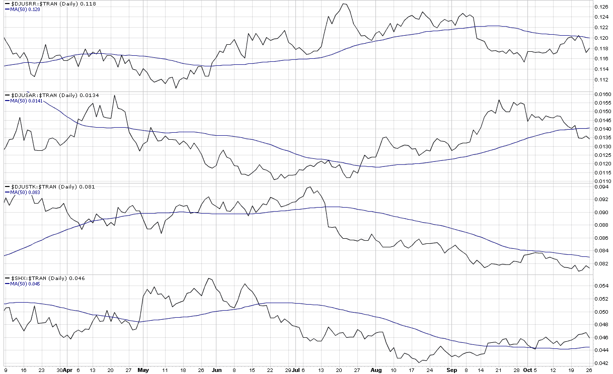

<!--yml
category: 未分类
date: 2024-05-18 17:25:08
-->

# VIX and More: Breaking Down the Weakness in Transports

> 来源：[http://vixandmore.blogspot.com/2009/10/breaking-down-weakness-in-transports.html#0001-01-01](http://vixandmore.blogspot.com/2009/10/breaking-down-weakness-in-transports.html#0001-01-01)

Yesterday’s [Chart of the Week: Falling Transports](http://vixandmore.blogspot.com/2009/10/chart-of-week-falling-transports.html) looked at the recent weakness in the [Dow Jones Transportation Average](http://en.wikipedia.org/wiki/Dow_Jones_Transportation_Average) ([DJTA](http://vixandmore.blogspot.com/search/label/DJTA)) and included a study of the performance of the index relative to the S&P 500 index.

Today I am going to look under the hood of the DJTA and highlight four often overlooked transportation sub-sector indices:

*   Dow Jones US Railroad Index [($DJUSRR](http://stockcharts.com/charts/gallery.html?%24djustr))
*   Dow Jones US Airlines Index [($DJUSAR](http://stockcharts.com/charts/gallery.html?%24djusar))
*   Dow Jones US Trucking Index [($DJUSTR](http://stockcharts.com/charts/gallery.html?%24djusar))
*   PHLX Marine Shipping Index ([$SHX](http://stockcharts.com/charts/gallery.html?%24shx))

The chart below, which plots each of the above sub-sector indices as a percentage of the DJTA shows that airlines have been the biggest laggard relative to the broader transportation average over the course of the past month, while railroads and truckers have also not been able to keep pace with the DJTA as of late. The relative strength in the transportation sector has come from the marine shippers – a point that is bolstered by the recent strength in the [Baltic Dry Index](http://vixandmore.blogspot.com/search/label/Baltic%20Dry%20Index) (not shown in the charts.)

While I have yet to see any ETFs for the railroad and trucking sectors, two ETFs that are available are the popular Claymore/Delta Global Shipping ETF ([SEA](http://vixandmore.blogspot.com/search/label/SEA)) and the less active Claymore/NYSE Arca Airline ([FAA](http://vixandmore.blogspot.com/search/label/FAA)).

For additional posts on the transports and their sub-sector indices, readers are encouraged to check out:

*[source: StockCharts]*