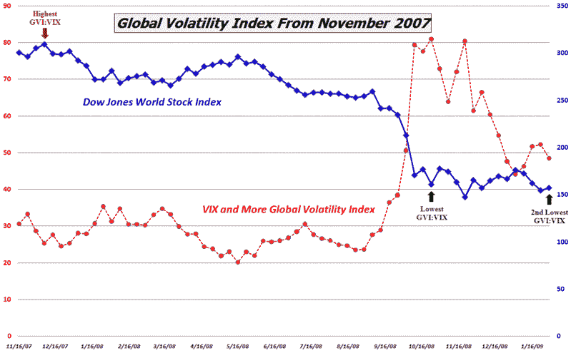

<!--yml
category: 未分类
date: 2024-05-18 18:02:17
-->

# VIX and More: Bullish Signal from Global Volatility Index

> 来源：[http://vixandmore.blogspot.com/2009/02/bullish-signal-from-global-volatility.html#0001-01-01](http://vixandmore.blogspot.com/2009/02/bullish-signal-from-global-volatility.html#0001-01-01)

*VIX and More*’s proprietary [Global Volatility Index](http://vixandmore.blogspot.com/search/label/Global%20Volatility%20Index) has been a big hit since I [unveiled it](http://vixandmore.blogspot.com/2008/11/introducing-vix-and-more-global.html) in November, which means that I will periodically update it and flag interesting developments in this space going forward.

At the close of Friday’s session, the difference between the Global Volatility Index and the VIX had narrowed to its lowest level since October and the premium percentage (the GVI divided by the VIX) was at its second lowest level ever. I consider this to be a bullish signal.

In the chart below, I have marked the previous highs and lows in the premium percentage with red and green arrows. The red arrow marking the high comes from the first week in December 2007 and was an excellent opportunity to sell or get short. The green arrow from late October was an early bottom. In the months that have followed, the [Dow Jones World Stock Index](http://vixandmore.blogspot.com/search/label/Dow%20Jones%20World%20Stock%20Index) has largely marked time. While this indicator is still relatively young and untested, I consider Friday’s second lowest reading to reinforce or confirm the October buy signal.

As always, caveat emptor.

*[source: VIX and More]*