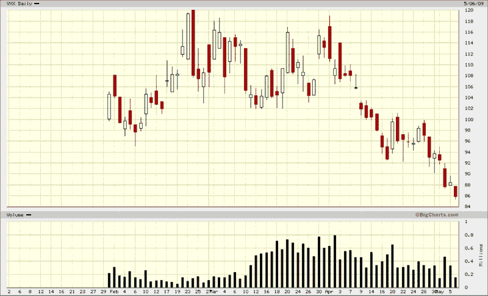

<!--yml
category: 未分类
date: 2024-05-18 17:48:40
-->

# VIX and More: Bullish on VXX

> 来源：[http://vixandmore.blogspot.com/2009/05/bullish-on-vxx.html#0001-01-01](http://vixandmore.blogspot.com/2009/05/bullish-on-vxx.html#0001-01-01)

All the preannouncements have taken most of the uncertainty out of the unveiling of the bank stress test results and not surprisingly, volatility has collapsed. With the VIX at 32.53 and VXX last trading at 85.19, this looks like a good time to get long [VXX](http://vixandmore.blogspot.com/search/label/VXX) and/or [VIX options](http://vixandmore.blogspot.com/search/label/VIX%20options).

*[source: BigCharts]*

***Disclosure****: Long VIX and VXX at time of writing.*