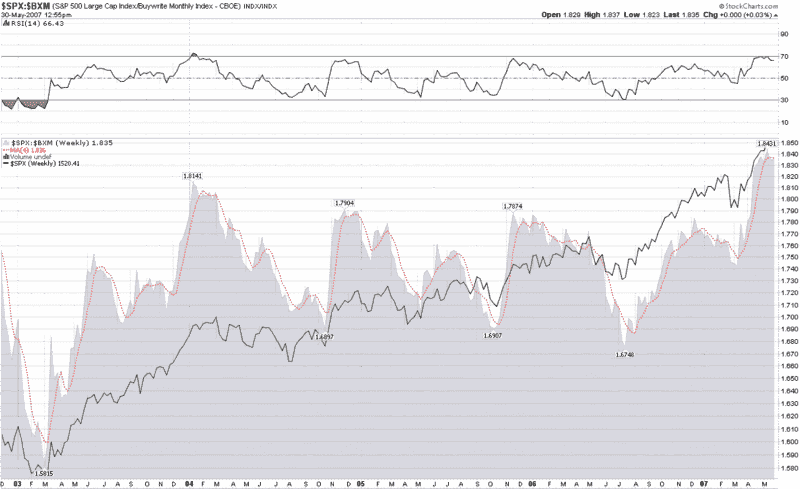

<!--yml
category: 未分类
date: 2024-05-18 19:12:49
-->

# VIX and More: BuyWrite Index as a Timing Tool?

> 来源：[http://vixandmore.blogspot.com/2007/05/buywrite-index-as-timing-tool.html#0001-01-01](http://vixandmore.blogspot.com/2007/05/buywrite-index-as-timing-tool.html#0001-01-01)

Adam at [Daily Options Report](http://adamsoptions.blogspot.com/) has recently been talking about the [CBOE S&P 500 BuyWrite Index (BXM)](http://www.cboe.com/micro/bxm/introduction.aspx) and related products in [considerable detail](http://adamsoptions.blogspot.com/search/label/BXM) – enough for me to finally take a look at it myself.  Between the information on the CBOE site linked above, Adam’s comments and the insights of ETF-friendly blogger [‘Random’ Roger Nusbaum](http://randomroger.blogspot.com/search?q=bxm), you can find out just about anything you might wish to know about the BXM and products that utilized covered call strategies.  Well, almost anything.

I got to wondering whether or not the BXM might be useful as a timing tool.  After spending a little time at [StockCharts.com](http://stockcharts.com/), I put together several ratio charts that compare the SPX to the BXM.  In a weekly ratio chart, appended below, I noted that for the last several years when the SPX to BXM ratio approaches 1.80 (or generally makes any 6-12 month high) and rolls over, this has usually provided some advance warning of a significant correction in the SPX over the next two to three months.  What particularly caught my attention in the current chart is very high 1.836 moving average reading that appears to be just beginning to roll over.

This ratio is something worth watching; and the BXM and related products [(BEP](http://finance.google.com/finance?q=bep&hl=en), [MCN](http://finance.google.com/finance?q=mcn&amp;hl=en), and the newly minted ETN, [BWV](http://finance.google.com/finance?q=bwv&hl=en)) are another way to think about harvesting volatility in what could be turning into a toppy market.

