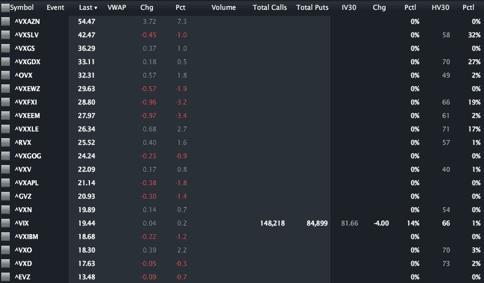

<!--yml
category: 未分类
date: 2024-05-18 16:41:54
-->

# VIX and More: CBOE Adds Options to Emerging Markets Volatility Index (VXEEM)

> 来源：[http://vixandmore.blogspot.com/2012/01/cboe-adds-options-to-emerging-markets.html#0001-01-01](http://vixandmore.blogspot.com/2012/01/cboe-adds-options-to-emerging-markets.html#0001-01-01)

Earlier this month, the CBOE [launched](http://vixandmore.blogspot.com/2011/12/cboe-to-launch-futures-on-emerging.html) futures on the CBOE Emerging Markets ETF Volatility Index ([VXEEM](http://vixandmore.blogspot.com/search/label/VXEEM)) and barely three weeks later, VXEEM options began trading today.

For more information on VXEEM options, which are based on the popular [EEM](http://vixandmore.blogspot.com/search/label/EEM) emerging markets ETF, a good first stop is the CBOE’s VXEEM [options product specification page](http://www.cboe.com/products/IndexOpts/VXEEM_spec.aspx). Of particular note is the fact the options expiration cycle is the same for VXEEM options as it is for the futures products. Additionally, VXEEM futures and options have the same expiration cycle as VIX futures and options, meaning that they will expire on Wednesdays (February 15, March 21, April 18 and May 16), with the options last traded on the Tuesday immediately following the expiration. For more information, check out the CBOE’s VXEEM [splash page](http://www.cboe.com/micro/VIXETF/VXEEM/) and [information circular](http://www.cfe.cboe.com/publish/CFEinfocirc/CFEIC11-079.pdf).

In the graphic below, courtesy of LivevolPro.com, I have collected closing data for some of the primary U.S. volatility indices, including those which are volatility indices for ETPs and single stocks. The indices are sorted from highest to lowest and provide a good sense of the market’s perceptions of relative risk across various stocks, groups of stocks (sectors and geographies) and asset classes.

Partly due to today’s earnings announcement, [VXAZN](http://vixandmore.blogspot.com/search/label/VXAZN), the volatility index for Amazon ([AMZN](http://vixandmore.blogspot.com/search/label/AMZN)) tops the list, with volatility indices for silver ([VXSLV](http://vixandmore.blogspot.com/search/label/VXSLV)), Goldman Sachs ([VXGS](http://vixandmore.blogspot.com/search/label/VXGS)) and gold miners ([VXGDX](http://vixandmore.blogspot.com/search/label/VXGDX)) rounding out the top four. VXEEM ranks eighth of the twenty volatility indices at 27.97 and currently carries a 43.8% premium to the VIX. Is that 43.8% premium too high? Too low? With VXEEM options (and futures) now you can not only express your opinion, but benefit financially if you are correct.

Related posts:

**

*[source(s): LivevolPro.com]*

***Disclosure(s):** Livevol is an advertiser on VIX and More*