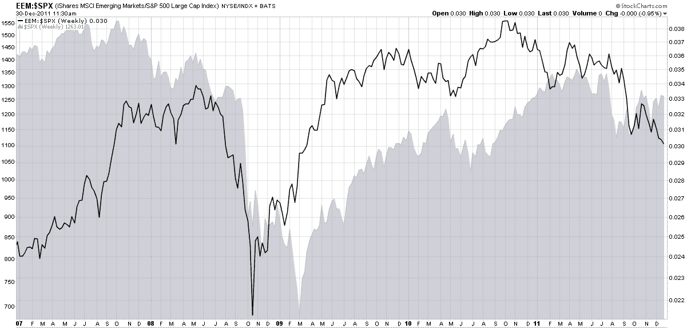

<!--yml
category: 未分类
date: 2024-05-18 16:44:36
-->

# VIX and More: CBOE To Launch Futures on Emerging Markets Volatility (VXEEM)

> 来源：[http://vixandmore.blogspot.com/2011/12/cboe-to-launch-futures-on-emerging.html#0001-01-01](http://vixandmore.blogspot.com/2011/12/cboe-to-launch-futures-on-emerging.html#0001-01-01)

One of the predictions I made for 2011 was that the trend toward what I have labeled “[atomic volatility](http://vixandmore.blogspot.com/search/label/atomic%20volatility)” (a lessening of the scope of the underlying for options contracts and/or the duration of those contracts) would accelerate.

Back in March 2011, the CBOE helped to usher in the atomic volatility era when they rolled out volatility indices using the VIX methodology for six sector and geography ETFs:

*   iShares MSCI Emerging Markets Index Fund ([VXEEM](http://vixandmore.blogspot.com/search/label/VXEEM))
*   iShares Trust FTSE China 25 Index Fund  ([VXFXI](http://vixandmore.blogspot.com/search/label/VXFXI))
*   iShares MSCI Brazil Index Fund  ([VXEWZ](http://vixandmore.blogspot.com/search/label/VXEWZ))
*   Market Vectors Gold Miners Fund ([VXGDX](http://vixandmore.blogspot.com/search/label/VXGDX))
*   iShares Silver Trust ([VXSLV](http://vixandmore.blogspot.com/search/label/VXSLV))
*   Energy Select Sector SPDR ([VXXLE](http://vixandmore.blogspot.com/search/label/VXXLE))

Later in March, the CBOE [rolled out](http://ir.cboe.com/releasedetail.cfm?ReleaseID=560015) futures based on the gold volatility index ([GVZ](http://vixandmore.blogspot.com/search/label/GVZ)), which was [launched](http://vixandmore.blogspot.com/search/label/GVZ) back in August 2008, at the same time as the euro volatility index ([EVZ](http://vixandmore.blogspot.com/search/label/EVZ)) and several weeks after the launch of the [OVX](http://vixandmore.blogspot.com/2008/07/cboe-launches-oil-vix-ovx.html), known affectionately as “the Oil VIX.” *[Those who are interested in the sequencing of the launch of various volatility measures should refer to [The Evolution of the Volatility Index Family Tree](http://vixandmore.blogspot.com/2008/08/evolution-of-volatility-index-family.html).]*

Now the CBOE is taking the next step with VXEEM, the volatility index that is based on the popular [emerging markets](http://vixandmore.blogspot.com/search/label/emerging%20markets) ETF ([EEM](http://vixandmore.blogspot.com/search/label/EEM)), and offering futures on that index. The launch of these futures contracts is set for January 9^(th) and will initially include contracts with expirations in February, March, April and May. Note that the expiration cycles for these contracts are the same as those for the VIX futures and options, meaning that they will expire on Wednesdays (February 15, March 21, April 18 and May 16) and can last be traded on the Tuesday immediately following the expiration. For more information, check out the CBOE’s VXEEM [splash page](http://www.cboe.com/micro/VIXETF/VXEEM/) and [information circular](http://www.cfe.cboe.com/publish/CFEinfocirc/CFEIC11-079.pdf).

One of the reasons I think products based on EEM and VXEEM have a good chance of being successful is that emerging markets are typically a highly volatile area – much more so than the basket of stocks included in the S&P 500 index on which the VIX is based. Right now, for instance, EEM has a 60-day historical volatility that is more than 50% higher than that of the SPX. All this means that short-term traders should find VXEEM products (futures as well as options and ETPs, assuming they are in the pipeline) to be the types of high-octane trading vehicles that are well-suited to some of their favorite strategies, much like leveraged ETPs and VIX-based products.

Additionally, as the chart below reminds us, emerging markets sometimes move in cycles that are distinct from U.S. stocks. Note that the ratio of EEM to SPX has varied wildly over the course of the past five years and has had different bottoms and tops than the SPX has. Whether this phenomenon will continue into the future (influenced strongly by [China](http://vixandmore.blogspot.com/search/label/China)) remains to be seen, but the role of emerging markets relative to developed markets should be watched closely in 2012\.

Related posts:

**

*[source(s): StockCharts.com]

**Disclosure(s):** none*