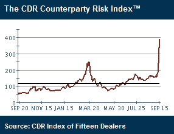

<!--yml
category: 未分类
date: 2024-05-18 18:26:39
-->

# VIX and More: CDR Counterparty Risk Index Swamps March High

> 来源：[http://vixandmore.blogspot.com/2008/09/cdr-counterparty-risk-index-swamps.html#0001-01-01](http://vixandmore.blogspot.com/2008/09/cdr-counterparty-risk-index-swamps.html#0001-01-01)

[Credit Derivatives Research](http://www.creditresearch.com/) has a Counterparty Risk Index (and a number of related sub-indices) which calculates the average credit spread of the 15 largest credit derivative dealers. Following the recent turmoil in the credit markets, the index now stands more than 50% higher than the previous March 2008 high.

Not surprisingly, the [Markit](http://vixandmore.blogspot.com/search/label/Markit) CDX ([credit default swap](http://vixandmore.blogspot.com/search/label/credit%20default%20swaps)) indices are seeing similar spikes.

[graphic courtesy of Credit Derivatives Research]