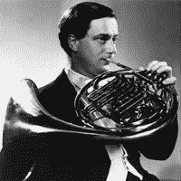

<!--yml
category: 未分类
date: 2024-05-18 15:47:40
-->

# VIX and More: CNBC Million Dollar Portfolio Challenge: Top 0.1%

> 来源：[http://vixandmore.blogspot.com/2007/04/cnbc-million-dollar-portfolio-challenge_26.html#0001-01-01](http://vixandmore.blogspot.com/2007/04/cnbc-million-dollar-portfolio-challenge_26.html#0001-01-01)

OK, so I didn’t buy [Amazon (AMZN)](http://finance.google.com/finance?q=amzn&hl=en) before their earnings report and missed an opportunity to log an ‘easy’ 27% gain yesterday.  I still made up some ground, however, with a more than respectable 2.9% gain in [VECO](http://finance.google.com/finance?q=veco&hl=en).

My portfolio is now up to $1.69 million, but with tenth place in the [CNBC Million Dollar Portfolio Challenge](http://vixandmore.blogspot.com/search/label/CNBC%20Million%20Dollar%20Portfolio%20Challenge) at $2.93 million, the task ahead continues to be a formidable one.  On the plus side, at #1260 out of [1,324,502 contestants](http://www.cnbc.com/id/18328716), I can at least claim to have made it into the top 0.1%.

As this contest has progressed I have discovered the need for an *earnings spike potential* algorithm and have spent some time testing and refining such a beast.  Yesterday, before the close, it kicked out three companies with a high potential to spike after they reported earnings after hours.  The good news is that the algorithm (which I will be glad to talk about after this contest is over) produced three highly volatile plays for today: [SWKS](http://finance.google.com/finance?q=swks&hl=en) (up 21% a little after noon EDT); [HLIT](http://finance.google.com/finance?q=hlit&hl=en) (down 15%); and [ARBA](http://finance.google.com/finance?q=arba&hl=en) (down 9%.)  Of the three, I looked hardest at SWKS and ended up passing on this one, as well as the other two.  The potential for volatility was certainly there, but I was concerned that it was more likely toe be in the wrong direction.  Instead, I went with a slightly less volatile play that has been showing a lot more momentum in the run up to earnings: [GSI Commerce (GSIC)](http://finance.google.com/finance?q=gsic&hl=en), whose retail e-commerce solutions helped deliver a quarter that was [good enough](http://biz.yahoo.com/prnews/070425/new055.html?.v=3) to overcome [two analyst downgrades](http://finance.yahoo.com/q/ud?s=GSIC) that knocked the stock down early this morning.  After opening down 5.3% this morning, the stock has rallied to where it is currently trading up 4% on the day.

And now for the horn tooting portion of this post.  For those who are late to the CNBC party, in the past when I have tooted my own horn here I have used the opportunity to highlight one of my favorite horn players.  First up were two jazz trumpeters: [Clifford Brown](http://vixandmore.blogspot.com/search/label/Clifford%20Brown); and [Lee Morgan](http://vixandmore.blogspot.com/search/label/Lee%20Morgan).  Today I want to turn my attention to classical music and [Dennis Brain](http://en.wikipedia.org/wiki/Dennis_Brain), who may be the greatest classically trained horn player of the modern era.  If you are not sure whether you are a fan of classical music, you owe it to yourself find a way to introduce your ears to [Brain’s 1953 rendition of the Mozart horn concertos](http://www.amazon.com/Mozart-Horn-Concertos-Nos-1-4/dp/B00000GCAD).  If this turns out to be a transformational experience in your life, don’t say I didn’t warn you.